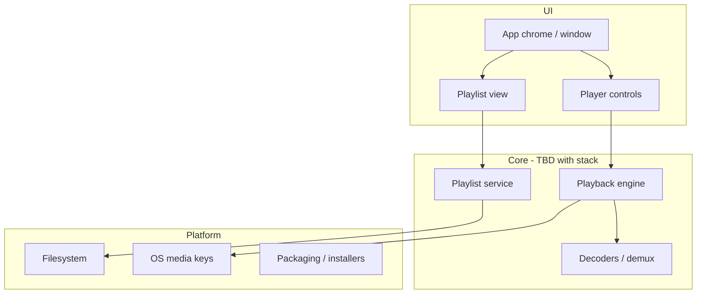

# Tramp architecture

Living design map of how Tramp is structured. Agents and humans update this whenever the app’s shape changes. Domain terms live in [`CONTEXT.md`](../CONTEXT.md); hard-to-reverse decisions live in [`docs/adr/`](adr/).

## Status

**Pre-implementation.** Product direction is being decided via the wayfinder map at `.scratch/tramp-v1-spec/`. Stack and module boundaries below are placeholders until locked.

## Intended product shape (v1)

- Multi-platform desktop player (Windows, Linux, macOS)
- Local playback; scalable UI with custom **app chrome** (no OS window frame)
- Playlist-centric (M3U/M3U8); no media library in v1
- Classic Winamp skins: out of v1

## System overview

## Modules (expected)

| Area | Responsibility | Status |
|------|----------------|--------|
| App chrome / UI | One-window scalable surface, resize, drag-to-move, close/minimize | Not started |
| Playback | Transport, seek, volume, shuffle/repeat | Not started |
| Formats | MP3, AAC/M4A, FLAC, WAV, Ogg Vorbis, Opus | Not started |
| Playlist | Open/save M3U/M3U8, edit order, restore last playlist | Not started |
| Platform | Media keys, packaging per OS | Not started |

## Stack

**Not locked.** Research in progress: Flutter (primary candidate) vs Tauri 2 + Rust (runner-up). See `.scratch/tramp-v1-spec/`.

## ADRs

None yet. Add links here when `docs/adr/` entries exist.
