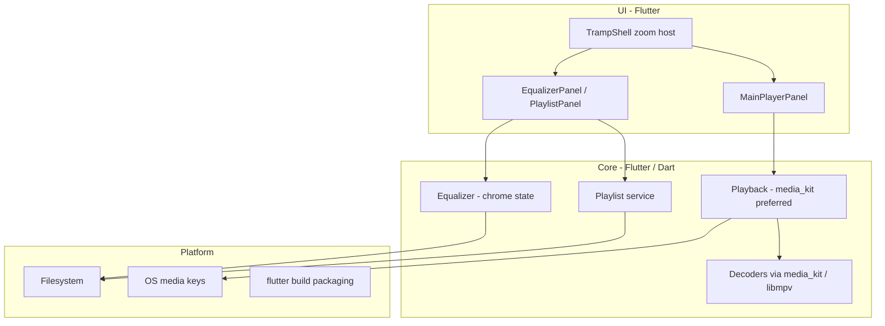

# Tramp architecture

Living design map of how Tramp is structured. Agents and humans update this whenever the app’s shape changes. Domain terms live in [`CONTEXT.md`](../CONTEXT.md); hard-to-reverse decisions live in [`docs/adr/`](adr/).

## Status

**v1 mostly implemented; chrome delivery pivoting.** Playback/playlist/platform match the shipped codebase; UI is moving from painted graphite chrome to a PNG graphite skin with zoom-only window sizing (ADRs 0003/0004). Product spec: [`tramp-v1-spec.md`](tramp-v1-spec.md). Stack locked (Flutter). App at repo root (`lib/`, `pubspec.yaml`, desktop runners under `windows/`, `macos/`, `linux/`). Release packaging smoke-tested on Windows (`flutter build windows`); macOS/Linux builds require those hosts.

## Intended product shape (v1)

- Multi-platform desktop player (Windows, Linux, macOS); shippable via Flutter packaging (stores not required)
- Local playback; custom **app chrome** (no OS window frame); main/EQ never stretch — EQ mode sized by **zoom step** only; playlist mode freely resizes the window around a fixed main canvas ([ADR 0003](adr/0003-zoom-only-window-size.md))
- Playlist-centric (M3U/M3U8); file associations for v1 audio + playlists; no media library in v1
- Classic Winamp WSZ loading, whole-chrome “Scalable UI”, gapless, and crossfade: out of v1
- Product spec target: `docs/tramp-v1-spec.md`
- UI direction: **graphite skin** — PNG-first chrome ([ADR 0004](adr/0004-png-graphite-skin.md)); delivery design [`2026-08-02-graphite-skin-delivery-design.md`](superpowers/specs/2026-08-02-graphite-skin-delivery-design.md); fixed logical canvases (main 812×242, equalizer 812×206) + root zoom ([ADR 0002](adr/0002-fixed-canvas-zoom.md))

## System overview

## Modules

| Area | Responsibility | Status |
|------|----------------|--------|
| App chrome / UI | `TrampShell` hosts the single root `Transform.scale` zoom transform (via `OverflowBox` so the stack lays out at true logical size) and switches the lower region between `EqualizerPanel` and `PlaylistPanel` (drop target, shortcuts including Ctrl±/0). `MainPlayerPanel` and `EqualizerPanel` are fixed logical canvases (812×242 / 812×206) and never stretch. Mode-aware window sizing per ADR 0003: EQ mode has no resize edges and snaps to the fixed stack; playlist mode enables `DragToResizeArea`, grows the playlist well to fill the window, and persists the (logical) window size. Pure sizing rules live in `lib/ui/window_layout.dart`; `app.dart` applies them via `WindowListener` + `window_manager`. **Target:** PNG graphite skin under hit targets; 9-slice playlist chrome; code draws spectrum, LCD/playlist text, thumbs, and asset state. **Current code:** `MainPlayerPanel` and `EqualizerPanel` are now the PNG skin (`SkinImage` face + `SkinButton`/`SkinSlider` controls + live overlays; EQ adds phosphor fader fills + code gain readouts, and a `equalizerShadeFace` strip when collapsed); `PlaylistPanel` is still painted `lib/ui/chrome/` — pivoting per skin delivery design + ADRs 0003/0004. Frameless drag via `window_manager` | Pivot in progress (main player + equalizer on skin) |
| Theme | `lib/theme/` — `TrampColors`, `TrampSurface` / `tramp_surfaces.dart`, `TrampText`, `TrampMetrics`. Surfaces remain for any coded overlays; skin PNGs own most panel faces under the new direction | Partial |
| Zoom | `lib/ui/zoom/` — `ZoomController` (six discrete steps 100–300%, persisted, steps too large for the display disabled) and `ZoomScope` (hairline snap). Title-bar zoom-in/out replace maximize (main player title bar: minimize, zoom−, zoom+, close; the ZOOM dropdown is retired). Resize edges follow ADR 0003: playlist mode only. See [ADR 0002](adr/0002-fixed-canvas-zoom.md), [ADR 0003](adr/0003-zoom-only-window-size.md) | Implemented |
| Brand art / skin | Full colour badge is `lib/ui/chrome/logo.svg` via `TrampLogo`. Compact title-bar mark is `TrampMark`. Skin layer in `lib/ui/skin/`: `GraphiteSkin` (asset paths + `mainDisplayWell`), `SkinImage` (a scaled `Image.asset`), `SkinButton` (skin-face control with idle/pressed/active sprites + hit target), `SkinSlider` (skin thumb over optional groove, value↔position mapping). Panel faces + control crops under `assets/skin/graphite/` (`controls/` for buttons/thumbs), cropped from the mockup by `.scratch/graphite-skin/*.py`. **Target:** full PNG pack for panel/control faces; SVG brand marks retained where useful ([ADR 0004](adr/0004-png-graphite-skin.md)) | Main player + equalizer control sets shipped (transport, shuffle/repeat, EQ/PL, volume thumb, OPEN; EQ ON/AUTO/PRESETS/collapse/close + full fader grip + shade face). Playlist chrome pending |
| Playback | `PlayerEngine` seam, `PlaybackController`, `MediaKitPlayerEngine` (local files via media_kit/libmpv); shuffle/repeat/volume/mute/seek. `levelsStream` → `AudioLevels` (media_kit emits synthetic frames; `SpectrumVisualizer` subscribes directly, not via `notifyListeners`). `formatStream` → `AudioFormatInfo` (bitrate / sample rate / channels as controller state). Levels contract: see the design spec’s “Audio levels” section | Implemented |
| Formats | MP3, AAC/M4A, FLAC, WAV, Ogg Vorbis, Opus via media_kit | Implemented |
| Playlist | Open/save M3U/M3U8, add/remove/reorder, play from selection, restore last playlist (`PlaylistController`, `M3uCodec`, `PlaylistStore`) | Implemented |
| Equalizer | UI: `EqualizerPanel` (preamp + ten bands, ON/AUTO, presets menu, windowshade collapse). State: `EqualizerSettings`, `EqualizerPresets`, `EqualizerController` in `lib/eq/`; persists via `TrampSettings` / `SettingsStore`. `EqualizerSink` seam has only `NoopEqualizerSink` — gains do not reach the audio path (shipped libmpv disables filter graphs while reporting success) | Chrome UI + state |
| Platform | `tramp_window` (frameless chrome; `resizeTrampWindow` + `setTrampWindowResizable` applied per mode target from `window_layout.dart`); `file_open` (pickers, folder expand, DnD); `launch_args` (argv → playlist/audio); file associations (Windows registry, macOS Info.plist, Linux `.desktop`); `OsMediaControls` (Windows SMTC, macOS MPRemoteCommandCenter; **Linux MPRIS stub — v1 gap**); `SettingsStore` (`settings.json` — zoom %, lower region, equalizer, playlist window size) | Implemented |

## Playback vs selection

`PlaybackController` keeps **`playingIndex`** (and path) separate from playlist **`selectedIndex`**. Transport title and OS media metadata follow the playing track; playlist row highlight follows selection. `playPause` opens the selected row when nothing is open or selection differs from the playing track.

## Known v1 gaps

- **Graphite skin PNGs** — product direction locked (ADRs 0003/0004, skin delivery design); mode-aware window sizing has landed (EQ zoom-only, playlist free resize + persisted size). The **main player** and **equalizer** now render the PNG skin; the **playlist** face is still painted chrome until its skin task lands.
- **Equalizer is chrome-only** — the panel and persisted curve ship; audible equalization does not, because the shipped libmpv cannot construct filter graphs (it reports success while silently disabling them). A real `EqualizerSink` must be verified by measuring output.
- **Spectrum levels are synthetic** — `MediaKitPlayerEngine` publishes `AudioLevels` with `synthetic: true` until the spectrogram subsystem lands. The display is honest about that contract.
- **Linux MPRIS** — session D-Bus player not registered; in-app shortcuts/media keys when focused still work.
- **Second-instance “Open with”** — argv on cold start only; no IPC to an already-running instance.
- **macOS/Linux release smoke** — not run on the primary dev host (Windows verified).

## Implementation notes (chrome)

These cost real time and will bite again:

- **No icon fonts or glyph characters in chrome.** `□` / `✕` are absent from Barlow, and `Icons.*` needs an unbundled Material font. Window controls, transport glyphs, and marks are all painted.
- **Panel stack needs a `Material` ancestor** — without it, Flutter’s debug build underlines every text span.
- **Tests that assert text must call `loadTrampFonts()`** (`test/support/test_fonts.dart`). The harness fallback face has wildly different metrics from Barlow Semi Condensed.
- **Flutter goldens are platform-specific.** Images under `test/golden/goldens/` were generated on Windows; CI on another OS needs its own golden set or a tolerance-based comparison.

## Stack

**Locked:** Flutter for v1 (Windows, Linux, macOS). Preferred defaults: `window_manager` (app chrome), media_kit/libmpv (playback), `flutter_svg` (brand art). Not locked: state management, routing, SDK versions, design-system packages. Not v1: Tauri, Electron, second UI toolkit.

- ADR: [0001-flutter-for-v1.md](adr/0001-flutter-for-v1.md)
- ADR: [0002-fixed-canvas-zoom.md](adr/0002-fixed-canvas-zoom.md)
- ADR: [0003-zoom-only-window-size.md](adr/0003-zoom-only-window-size.md)
- ADR: [0004-png-graphite-skin.md](adr/0004-png-graphite-skin.md)
- Research: [`.scratch/tramp-v1-spec/research/v1-stack.md`](../.scratch/tramp-v1-spec/research/v1-stack.md)

## ADRs

- [0001 — Flutter for Tramp v1](adr/0001-flutter-for-v1.md)
- [0002 — Fixed logical canvas plus a single transform for zoom](adr/0002-fixed-canvas-zoom.md)
- [0003 — Window size only via zoom steps](adr/0003-zoom-only-window-size.md)
- [0004 — PNG-first graphite skin for chrome look](adr/0004-png-graphite-skin.md)
