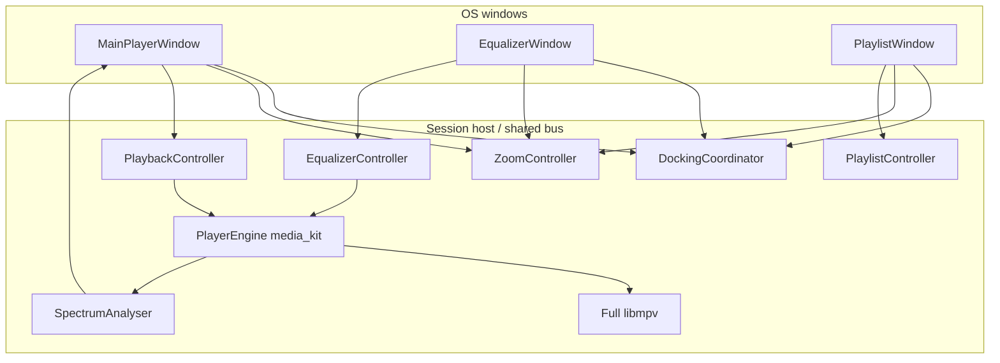

# Tramp architecture

Living design map of how Tramp is structured. Agents and humans update this whenever the app’s shape changes. Domain terms live in [`CONTEXT.md`](../CONTEXT.md); hard-to-reverse decisions live in [`docs/adr/`](adr/).

## Status

**Mockup multi-window redesign in progress.** Product direction is three dockable windows, code-constructed chrome from [`player-mockup-2.html`](../player-mockup-2.html), and full libmpv (audible EQ, real spectrum, Mono) — see [`tramp-v1-spec.md`](tramp-v1-spec.md) and [`2026-08-08-mockup-multiwindow-redesign-design.md`](superpowers/specs/2026-08-08-mockup-multiwindow-redesign-design.md). The shipped tree still has the prior single-window PNG graphite shell; that look and window model are **retired** for new work (ADRs 0003/0004 superseded by 0006/0007). Stack locked (Flutter). App at repo root (`lib/`, `pubspec.yaml`, desktop runners under `windows/`, `macos/`, `linux/`).

## Intended product shape (v1)

- Multi-platform desktop player (Windows, Linux, macOS); shippable via Flutter packaging (stores not required)
- Local playback; custom **app chrome** (no OS window frame); **three** frameless windows with Winamp-style docking ([ADR 0006](adr/0006-multi-window-docking.md))
- Main and EQ: fixed logical canvases (**825×348**) sized by **global** discrete zoom only; playlist freely resizes (default **825×696**) ([ADR 0002](adr/0002-fixed-canvas-zoom.md))
- **Code-constructed** mockup chrome — not PNG graphite ([ADR 0007](adr/0007-code-constructed-mockup-chrome.md))
- **Full libmpv** bundled; media_kit remains the control seam ([ADR 0005](adr/0005-full-libmpv.md)); audible EQ (measurement-gated), real 20-bar spectrum, force-mono
- Playlist-centric (M3U/M3U8); file associations for v1 audio + playlists; no media library in v1
- Classic Winamp WSZ loading, whole-chrome “Scalable UI”, gapless, and crossfade: out of v1
- Product spec target: `docs/tramp-v1-spec.md`
- UI authority: `player-mockup-2.html` + redesign design doc above

## System overview

One Flutter process; three frameless windows share playback, playlist, EQ, zoom, settings, and `DockingCoordinator`.

## Modules

| Area | Responsibility | Status |
|------|----------------|--------|
| Multi-window host | Three frameless OS windows via `desktop_multi_window` + forked `window_manager`. `SessionHostApp` (main engine) owns settings/docking/`SessionBus`; `SessionClientApp` runs EQ/PL engines (placeholder chrome until Tasks 6–8). Main close quits; EQ/PL close hides. Frames applied from `DockingCoordinator.frameFor` | Partial (entry + bus + OS windows; chrome pending) |
| Session bus | `lib/ui/session/`: JSON `SessionEvent` / `SessionCommand` codec; host registers unidirectional `WindowMethodChannel('tramp/session')`; clients send commands; host pushes events/frames via per-window `WindowController.invokeMethod` | Partial (codec + host/client shells) |
| Docking | `DockingCoordinator` + `DockLayout` (`lib/ui/docking/`): edge snap (12px), sticky group drag, undock via >48px break or shift; shade height = `TrampMetrics.titleBar`; host applies pixel frames to OS windows ([ADR 0006](adr/0006-multi-window-docking.md)) | Partial (layout + host apply; drag UX pending) |
| App chrome / UI | Code-constructed shell, title bar, screen wells, buttons, sliders, LEDs, plates/rails from mockup tokens + geometry — no PNG panel faces ([ADR 0007](adr/0007-code-constructed-mockup-chrome.md)). Main clutterbar **O / A / I** only. Chrome primitives shared across windows | Target (redesign); prior `TrampShell` + PNG skin retired for new work |
| Theme / tokens | `MockupTokens` + `TrampMetrics` (825×348 / 825×348 / 825×696, titleBar 42) mirror mockup `:root` / classic×3 grid; `TrampColors` / `TrampText` facade cyan phosphor + TrampCondensed/TrampMono. Gradients/radii/chrome recipe still pending cutover | Partial (foundation landed; chrome still PNG graphite) |
| Zoom | Global discrete zoom (six steps 100–300%, persisted, display-fit gating). Main title-bar −/+ (and shortcuts) scale all three windows; pixel size = logical × zoom. Playlist user size stored in logical coordinates ([ADR 0002](adr/0002-fixed-canvas-zoom.md)) | Partial (controller exists; must become global across three windows) |
| Playback | `PlayerEngine` seam, `PlaybackController`, `MediaKitPlayerEngine`; shuffle/repeat/volume/mute/seek; after stop, media unloaded so next play re-opens. Format metadata stream for bitrate / sample rate / channels | Implemented (control seam); binary path → full libmpv |
| Libmpv bundle | `LibmpvBundle`: ship full libmpv (+ FFmpeg) for Win/macOS/Linux; override media_kit slim libs so the process cannot silently load them ([ADR 0005](adr/0005-full-libmpv.md)). Spike gate before claiming audible EQ | Target (redesign) |
| Formats | MP3, AAC/M4A, FLAC, WAV, Ogg Vorbis, Opus via full libmpv | Implemented (formats); bundling path changing |
| Playlist | Open/save M3U/M3U8, add/remove/reorder/clear, select-one, play from selection, restore last playlist (`PlaylistController`, `M3uCodec`, `PlaylistStore`). Sort and bulk selection (select-all / invert) are later UI targets | Implemented (logic above); UI moves to detachable window |
| Equalizer | Real `EqualizerSink` committing a libmpv EQ graph when On; measurement-gated before UI implies audible processing. Chrome: On / Auto / Presets, live curve plot, preamp + ten bands ±12 dB, windowshade. Auto keeps existing Tramp semantics unless the product spec says otherwise | Target (audible); chrome+state exist under prior shell |
| Spectrum | `SpectrumAnalyser`: PCM/analyser → STFT → 20 bars. `AudioLevels.synthetic` only as hard-fail/dev signal — not the normal product path | Target (redesign); synthetic path remains until analyser lands |
| Mono | Force downmix via mpv when Mono is on; distinct from source STEREO/MONO meta tag | Target (redesign) |
| Platform | Frameless multi-window APIs; file open / DnD / launch args; file associations; OS media controls; settings persistence (`TrampSettings`: zoom, always-on-top, mono, per-window frames, dock edges, EQ curve — migrates legacy `lowerRegion`) | Partial (settings model landed; single-window shell still maps visibility ↔ lower region) |

## Playback vs selection

`PlaybackController` keeps **`playingIndex`** (and path) separate from playlist **`selectedIndex`**. Transport title and OS media metadata follow the playing track; playlist row highlight follows selection. `playPause` opens the selected row when nothing is open or selection differs from the playing track. After **stop**, media is unloaded so resume re-opens the current track (media_kit unloads on stop; bare `play()` would ghost-play with no audio).

## Known v1 gaps

- **Full libmpv not yet bundled** — audible EQ and real spectrum depend on replacing slim media_kit libs and passing the measurement / load-path spike ([ADR 0005](adr/0005-full-libmpv.md)).
- **Multi-window chrome** — OS windows + session bus are wired; EQ/PL still show placeholders and main is a host shell until mockup chrome tasks land ([ADR 0006](adr/0006-multi-window-docking.md)).
- **Chrome cutover** — code-constructed mockup chrome replaces PNG graphite atomically for all three windows; mixed graphite/mockup UI must not ship ([ADR 0007](adr/0007-code-constructed-mockup-chrome.md)).
- **Linux MPRIS** — session D-Bus player not registered; in-app shortcuts/media keys when focused still work.
- **Second-instance “Open with”** — argv on cold start only; no IPC to an already-running instance.
- **macOS/Linux release smoke** — not run on the primary dev host (Windows verified for prior packaging).

## Implementation notes (chrome)

These cost real time and will bite again:

- **Fidelity is mockup-absolute** — side-by-side diffs vs `player-mockup-2.html` at 100%; mismatches are defects. No Material ink splash as the visible affordance.
- **No leftover PNG graphite faces** on the product path after cutover (`GraphiteSkin` / `assets/skin/graphite/` retired).
- **Panel stack / Material ancestor** — Flutter debug builds still expect a `Material` ancestor for text underlines where Material widgets remain.
- **Tests that assert text must load Tramp fonts** (Condensed / Mono per mockup). Harness fallback faces have different metrics.
- **Flutter goldens are platform-specific.** Prefer mockup screenshot diffs for chrome; CI on another OS needs its own golden set or tolerance-based comparison.

## Stack

**Locked:** Flutter for v1 (Windows, Linux, macOS). Preferred defaults: multi-window host + docking for app chrome, media_kit control seam + **full libmpv** for playback/EQ/mono, code-constructed chrome from the HTML mockup. Not locked: state management, routing, SDK versions, design-system packages. Not v1: Tauri, Electron, second UI toolkit.

- ADR: [0001-flutter-for-v1.md](adr/0001-flutter-for-v1.md)
- ADR: [0002-fixed-canvas-zoom.md](adr/0002-fixed-canvas-zoom.md) (revised — global zoom across three canvases)
- ADR: [0005-full-libmpv.md](adr/0005-full-libmpv.md)
- ADR: [0006-multi-window-docking.md](adr/0006-multi-window-docking.md)
- ADR: [0007-code-constructed-mockup-chrome.md](adr/0007-code-constructed-mockup-chrome.md)
- Superseded: [0003](adr/0003-zoom-only-window-size.md), [0004](adr/0004-png-graphite-skin.md)
- Research: [`.scratch/tramp-v1-spec/research/v1-stack.md`](../.scratch/tramp-v1-spec/research/v1-stack.md) (historical; slim-libmpv EQ limits do not constrain full libmpv)

## ADRs

- [0001 — Flutter for Tramp v1](adr/0001-flutter-for-v1.md)
- [0002 — Fixed logical canvas plus a single transform for zoom](adr/0002-fixed-canvas-zoom.md)
- [0003 — Window size only via zoom steps](adr/0003-zoom-only-window-size.md) *(superseded by 0006)*
- [0004 — PNG-first graphite skin for chrome look](adr/0004-png-graphite-skin.md) *(superseded by 0007)*
- [0005 — Full libmpv bundling](adr/0005-full-libmpv.md)
- [0006 — Multi-window docking](adr/0006-multi-window-docking.md)
- [0007 — Code-constructed mockup chrome](adr/0007-code-constructed-mockup-chrome.md)
