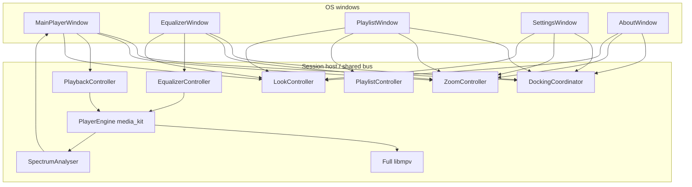

# Tramp architecture

Living design map of how Tramp is structured. Agents and humans update this whenever the app’s shape changes. Domain terms live in [`CONTEXT.md`](../CONTEXT.md); hard-to-reverse decisions live in [`docs/adr/`](adr/).

## Status

**Mockup multi-window redesign + settings/about windows.** Five frameless windows (main / EQ / playlist / settings / about), code-constructed chrome from [`player-mockup-2.html`](../player-mockup-2.html), and full libmpv (audible EQ, real spectrum, Mono) — see [`tramp-v1-spec.md`](tramp-v1-spec.md), [`2026-08-08-mockup-multiwindow-redesign-design.md`](superpowers/specs/2026-08-08-mockup-multiwindow-redesign-design.md), and [`2026-08-09-ui-polish-docking-taskbar-design.md`](superpowers/specs/2026-08-09-ui-polish-docking-taskbar-design.md). PNG graphite `TrampShell` / `assets/skin/graphite/` are removed (ADRs 0003/0004 superseded by 0006/0007). Stack locked (Flutter). App at repo root (`lib/`, `pubspec.yaml`, desktop runners under `windows/`, `macos/`, `linux/`).

## Intended product shape (v1)

- Multi-platform desktop player (Windows, Linux, macOS); shippable via Flutter packaging (stores not required)
- Local playback; custom **app chrome** (no OS window frame); **five** frameless windows — main/EQ/PL with Winamp-style docking; **settings** and **about** freestanding (not snappable, not in main drag cohort) ([ADR 0006](adr/0006-multi-window-docking.md))
- Main title drag moves all **visible** EQ/PL satellites (settings/about excluded); EQ/PL drag moves self and may snap. Settings stays raised above other Tramp windows. Windows taskbar shows **main only**
- Main and EQ: fixed logical canvases (**825×348**) sized by **global** discrete zoom only; playlist freely resizes (default **825×696**); settings fixed **520×420**; about fixed **480×360** ([ADR 0002](adr/0002-fixed-canvas-zoom.md))
- **Code-constructed** mockup chrome — not PNG graphite ([ADR 0007](adr/0007-code-constructed-mockup-chrome.md)); EQ/PL/settings/about compact titles; EQ band spectrum-gradient fill; `.wbtn` bevel chrome
- **Skins** (mockup recolor packs: `skin.json` / legacy `look.json`) managed in Settings; classic WSZ skins remain a separate concept
- **Full libmpv** bundled; media_kit remains the control seam ([ADR 0005](adr/0005-full-libmpv.md)); audible EQ (measurement-gated), real 20-bar spectrum, force-mono
- Playlist-centric (M3U/M3U8); file associations for v1 audio + playlists; no media library in v1
- Classic Winamp WSZ loading, whole-chrome “Scalable UI”, gapless, and crossfade: out of v1
- Product spec target: `docs/tramp-v1-spec.md`
- UI authority: `player-mockup-2.html` + redesign / polish design docs above

## System overview

One Flutter process; five frameless windows share playback, playlist, EQ, zoom, skins, settings, and `DockingCoordinator`.

## Modules

| Area | Responsibility | Status |
|------|----------------|--------|
| Multi-window host | Five frameless OS windows via `desktop_multi_window` (path override `third_party/desktop_multi_window`: Linux/Win/mac secondary **per-role** 75% seed — EQ **619×261**, playlist **619×522**, settings **390×315**, about **360×270** — plus transparent secondary FlView; no GTK header bar) + forked `window_manager`. `SessionHostApp` (main engine) owns settings/docking/`SessionBus` + `PlaybackController`/`PlaylistController`/`EqualizerController`/`LookController`; mounts `MainPlayerWindow` under `ListenableBuilder` → `LookScope(look: controller.resolved)`. `SessionClientApp` mounts `EqualizerWindow` / `PlaylistWindow` / `SettingsWindow` / `AboutWindow` on secondary roles with local `ResolvedLook` + `LookScope`. EQ + playlist + settings session commands drive host controllers; `EqSnapshotEvent` / `PlaylistSnapshotEvent` / `PlaybackSnapshotEvent` / `LookSnapshotEvent` / `SettingsSnapshotEvent` fan-out (look + settings snapshot pushed on settings `ClientReady`); shade via `SetShadedCommand`; playlist edge resize reports `ResizePlaylistCommand` → `DockingCoordinator.resizePlaylist`. Title-bar drag uses OS `startDragging` for the active window; `onWindowMove` → `DockingCoordinator.move` (snap deferred) → coalesced **sibling-only** position applies via `moveCohortOf` (settings/about excluded from main cohort); full frame + snap + persist + `DockSnapshotEvent` on `onWindowMoved`. Main close persists resume then `_exit`s the process (optional confirm; does not await secondary Flutter engine GTK/GL destroy); OS windows stay hidden until session chrome has painted; EQ/PL/settings/about close hides. Main minimize may hide visible secondaries including settings/about (`MinimizeGroupCycle` + `minimizeHidesSecondaries`). Main `onWindowFocus` raises visible EQ/PL (`SessionBus.pushRaise`), refocuses main, then `SessionBus.pushOrderTop` settings so it stays above Tramp peers without stealing focus. **Transparent HWND** (`setBackgroundColor(0x00000000)`) so `MockupShell` rounded corners show the desktop. **Windows taskbar:** secondaries call `waitUntilReadyToShow` then `setSkipTaskbar(true)`. Frames from `DockingCoordinator.frameFor` | Implemented |
| Session bus | `lib/ui/session/`: JSON `SessionEvent` / `SessionCommand` codec; host registers unidirectional `WindowMethodChannel('tramp/session')`; clients send commands (including `MoveWindowCommand`, `UpdateGeneralSettingsCommand`, skin install/activate/reset); host pushes events/frames via per-window `WindowController.invokeMethod` (`apply_frame` supports `positionOnly` during drag; `order_top_window` shows without focus). `LookSnapshotEvent` carries resolved palette/materials/families plus optional absolute `fontFiles` paths so secondary engines can `LookFontLoader`-register the same families (engines do not share `FontLoader`) | Implemented |
| Docking | `DockingCoordinator` + `DockLayout` + `DockDragArea` + `DockMoveCoalescer` + `NativeDragTracker` + `LinuxDragPoll` (`lib/ui/docking/`): main title drag translates its **dock cohort** (`moveCohortOf` → edge `groupOf` plus geometrically flush satellites within snap threshold; freestanding settings/about never join); EQ/PL peel on drag (min `peelDelta` 8 logical px so setPosition echoes do not sever edges) and snap only on finalize (EQ any side; PL top/bottom + optional L/R flush; threshold from `dockSnapStrength` 0/20/40); freestanding windows move alone and never snap / never are snap targets; undock via peel / Shift / separation; hide clears edges; shade height = `TrampMetrics.titleBar`; OS `startDragging`; end via `onWindowMoved` (Windows) or quiet softEnd (Linux — plugin often emits neither `move` nor `moved` during drag, so `LinuxDragPoll` reports **motion-only** position changes to arm quiet-end; arming on every poll tick deadlocked snap finalize); zoom steps call `reanchorForZoom` ([ADR 0006](adr/0006-multi-window-docking.md), [polish design](superpowers/specs/2026-08-09-ui-polish-docking-taskbar-design.md)) | Implemented |
| App chrome / UI | Code-constructed primitives in `lib/ui/chrome/mockup/` plus `MockupMainPlayer` / `MainPlayerWindow`, `MockupEqualizer` / `EqualizerWindow`, `MockupPlaylist` / `PlaylistWindow`, `MockupSettings` / `SettingsWindow`, and `AboutWindow` — absolute mockup geometry, options cog (menu: AOT / Settings… / track info / about / quit), General + Skins tabs in settings, live EQ curve, EQ band bottom→thumb spectrum-gradient fill, compact EQ/PL/settings/about titles (role only), `.wbtn` inset bevel chrome, playlist footer **110** + bottom-right `WindowResizeGrip` / edge `DragToResizeArea` for free resize, about credits in three registers — shell face (Tramp badge, wordmark, `trampBackronym` with lit initials, version readout), `MockupScreen` stats well (`AboutStats`), and maker's plate (`ProximaMagnificaMark` + company + © year + https://tramp.music chip) ([ADR 0007](adr/0007-code-constructed-mockup-chrome.md), [options cog](superpowers/specs/2026-08-10-options-cog-design.md)). PNG graphite / `TrampShell` deleted | Implemented |
| Theme / tokens | `MockupTokens` + `TrampMetrics` (825×348 / 825×348 / 825×696 / 520×420 settings / 480×360 about, titleBar 42) mirror mockup `:root` / classic×3 grid. Chrome reads palette/materials/fonts via `LookScope` → `ResolvedLook` (`TrampColors` / `TrampText` / `LookPaint` for derived title-bar, `.btn`, `.wbtn`, blooms). **Skins:** `lib/look/` parse/merge/catalog/install + `LookController` (host; `activeSkinId` / `skinsDirectory`, legacy look keys on load); session bus syncs `LookSnapshotEvent` + `SettingsSnapshotEvent` to secondary engines ([design](superpowers/specs/2026-08-09-look-pack-format-design.md)) | Implemented |
| Zoom | Global discrete zoom (eight steps 50–300%, default 75%, persisted, display-fit gating). Main title-bar −/+ (and shortcuts) resize all three HWNDs (`logical × zoom`) and scale each panel via root `ZoomedCanvas` (`OverflowBox` → uniform `Transform.scale` + `ZoomScope`; OverflowBox must wrap the scale so inverse hit-tests stay in-bounds at factor &lt; 1) per [ADR 0002](adr/0002-fixed-canvas-zoom.md). Before applying frames, `DockingCoordinator.reanchorForZoom` keeps free-window screen corners fixed and reseats docked windows against partners. Main/EQ pass a fixed `logicalSize` (OS sub-pixel rounding is clipped, not reflowed); playlist omits it and derives logical size from window constraints so only spacing grows. Frame apply goes through `resizeTrampWindow` (pin max size for fixed panels; Linux verifies/`setSize` nudge if GTK keeps a stale default; re-pin after `show` so mapping cannot restore the unmapped seed). Linux runner default size matches 75% main canvas; secondary native seeds are per-role 75% canvases, not Flutter’s 1280×720 template | Implemented |
| Playback | `PlayerEngine` seam, `PlaybackController`, `MediaKitPlayerEngine`; shuffle/repeat/volume/mute/seek; after stop, media unloaded so next play re-opens. Format metadata stream for bitrate / sample rate / channels | Implemented (control seam); binary path → full libmpv |
| Libmpv bundle | `LibmpvBundle.verify()` + `third_party/libmpv` pins/fetch scripts; Windows CMake replaces media_kit slim `libmpv-2.dll` with the staged full build; Linux optional bundle dir; macOS audio-full fetch documented ([ADR 0005](adr/0005-full-libmpv.md)). Debug/profile startup fails on slim marker `--disable-filters` | Partial (Windows fetch + load override + verify; macOS/Linux packaging follow-through) |
| Formats | MP3, AAC/M4A, FLAC, WAV, Ogg Vorbis, Opus via full libmpv | Implemented (formats); bundling path changing |
| Playlist | Open/save M3U/M3U8, add/remove/reorder/clear, multi-select (select-all / invert), sort (title/artist/duration/path/reverse), play from selection, restore last playlist (`PlaylistController`, `M3uCodec`, `PlaylistStore`). Background `TrackMetadataProbe` fills missing durations for TOTAL / row times. Mockup `PlaylistWindow` + DnD enqueue; frameless free resize via corner grip + L/R/B `DragToResizeArea` → `ResizePlaylistCommand` | Implemented |
| Equalizer | Mockup EQ chrome (`EqualizerWindow`) drives host `EqualizerController` over the session bus; host wires `MpvEqualizerSink` on the shared media_kit `Player` (`buildEqualizerAf` → mpv `af` lavfi equalizer). Chrome: On / Auto / Presets, live curve from gains, preamp + ten bands ±12 dB with spectrum-gradient track fill, Tramp logo watermark in the empty band-row gap, windowshade. Audibility gated by `tool/eq_measure.dart` on full libmpv | Partial (UI + state + audible sink); measurement gate on Windows |
| Spectrum | `SpectrumAnalyzer` (`lib/analysis/`): second mpv `ao=pcm` decode → isolate STFT → 20 bars; engine publishes `synthetic: false` in normal play. Bar gradient reused for EQ band fill | Implemented |
| Mono | `MonoController` / `PlayerEngine.setForceMono` → mpv `audio-channels` `mono`/`auto`; main Mono button → settings + engine | Implemented |
| Platform | Frameless multi-window APIs (**windows-x64** on Windows); file open / DnD / launch args; file associations; OS media controls; settings persistence (`TrampSettings`: zoom, AOT, mono, five window frames, dock edges, EQ curve, general prefs, skins — migrates legacy `lowerRegion` / `activeLookId` / `looksDirectory`); `session_resume.json` for playback index/position when resume-last-session is on; secondary windows skip the Windows taskbar | Partial (settings + session host wired; file associations / second-instance still hardening) |

## Playback vs selection

`PlaybackController` keeps **`playingIndex`** (and path) separate from playlist **`selectedIndex`**. Transport title and OS media metadata follow the playing track; playlist row highlight follows selection. `playPause` opens the selected row when nothing is open or selection differs from the playing track. After **stop**, media is unloaded so resume re-opens the current track (media_kit unloads on stop; bare `play()` would ghost-play with no audio).

## Quit

Main close (`SessionHostApp._quit`) runs optional confirm, persists the resume snapshot, then `_exit`s the process (`lib/ui/session/session_quit.dart`). It does **not** await per-window `session_shutdown` / GTK FlView destroy — that compositor teardown is multi-second on Linux. Regression harness: `TRAMP_AUTO_QUIT=1` + [`tool/measure_quit_latency.sh`](../tool/measure_quit_latency.sh) (budget 500ms from quit start to process death).

## Cold start

OS windows stay unmapped until `SessionHostApp` has mounted chrome and one frame has painted (`sessionWindowShouldShow`). Linux/Windows/macOS runners must not show on the first Flutter frame — that was the black “starting session…” rectangle. Secondaries remain `hiddenAtLaunch` until the same reveal.

## Known v1 gaps

- **Mockup goldens** — side-by-side mockup fidelity / platform golden sets still hardening; docking + 2026-08-09 polish (button bevel, dock rules, EQ fill, compact titles, taskbar) are implemented — see [`2026-08-09-ui-polish-docking-taskbar-design.md`](superpowers/specs/2026-08-09-ui-polish-docking-taskbar-design.md).
- **Full libmpv on macOS/Linux** — Windows fetch + CMake load override are the verified path; macOS/Linux full-binary packaging and release smoke are not yet at the same bar ([ADR 0005](adr/0005-full-libmpv.md)).
- **Linux MPRIS** — session D-Bus player not registered; in-app shortcuts/media keys when focused still work.
- **Second-instance “Open with”** — argv on cold start only; no IPC to an already-running instance.
- **macOS/Linux release smoke** — not run on the primary dev host (Windows verified for prior packaging).
- **Spectrum decode cost** — each open runs a second `ao=pcm` pass before frames are indexed; long tracks analyse in the background (honest silence until ready).
- **About usage stats are fiction** — the stats well renders `AboutStats.placeholder` (`measured` false); real playlist/track/time/spin counters wait on the playlist-manager overhaul and a session-bus snapshot ([issue](../.scratch/about-usage-stats/issues/01-wire-real-usage-counters.md)).

## Implementation notes (chrome)

These cost real time and will bite again:

- **Fidelity is mockup-absolute** — side-by-side diffs vs `player-mockup-2.html` at 100%; mismatches are defects. No Material ink splash as the visible affordance.
- **No PNG graphite faces** — `GraphiteSkin` / `assets/skin/graphite/` removed; chrome is mockup code only.
- **Panel stack / Material ancestor** — Flutter debug builds still expect a `Material` ancestor for text underlines where Material widgets remain.
- **Tests that assert text must load Tramp fonts** (Condensed / Mono per mockup). Harness fallback faces have different metrics.
- **Flutter goldens are platform-specific.** Prefer mockup screenshot diffs for chrome; CI on another OS needs its own golden set or tolerance-based comparison.

## Stack

**Locked:** Flutter for v1 (Windows, Linux, macOS). Preferred defaults: multi-window host + docking for app chrome, media_kit control seam + **full libmpv** for playback/EQ/mono, code-constructed chrome from the HTML mockup. Not locked: state management, routing, SDK versions, design-system packages. Not v1: Tauri, Electron, second UI toolkit.

- ADR: [0001-flutter-for-v1.md](adr/0001-flutter-for-v1.md)
- ADR: [0002-fixed-canvas-zoom.md](adr/0002-fixed-canvas-zoom.md) (revised — global zoom across three canvases)
- ADR: [0005-full-libmpv.md](adr/0005-full-libmpv.md)
- ADR: [0006-multi-window-docking.md](adr/0006-multi-window-docking.md)
- ADR: [0007-code-constructed-mockup-chrome.md](adr/0007-code-constructed-mockup-chrome.md)
- Design: [2026-08-09-ui-polish-docking-taskbar-design.md](superpowers/specs/2026-08-09-ui-polish-docking-taskbar-design.md)
- Superseded: [0003](adr/0003-zoom-only-window-size.md), [0004](adr/0004-png-graphite-skin.md)
- Research: [`.scratch/tramp-v1-spec/research/v1-stack.md`](../.scratch/tramp-v1-spec/research/v1-stack.md) (historical; slim-libmpv EQ limits do not constrain full libmpv)

## ADRs

- [0001 — Flutter for Tramp v1](adr/0001-flutter-for-v1.md)
- [0002 — Fixed logical canvas plus a single transform for zoom](adr/0002-fixed-canvas-zoom.md)
- [0003 — Window size only via zoom steps](adr/0003-zoom-only-window-size.md) *(superseded by 0006)*
- [0004 — PNG-first graphite skin for chrome look](adr/0004-png-graphite-skin.md) *(superseded by 0007)*
- [0005 — Full libmpv bundling](adr/0005-full-libmpv.md)
- [0006 — Multi-window docking](adr/0006-multi-window-docking.md)
- [0007 — Code-constructed mockup chrome](adr/0007-code-constructed-mockup-chrome.md)
- [0008 — Playlist collection stores references; skins stay copies](adr/0008-playlist-collection-stores-references.md)
