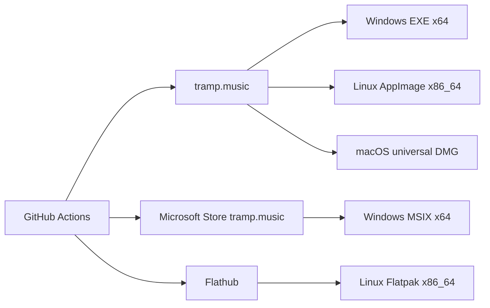
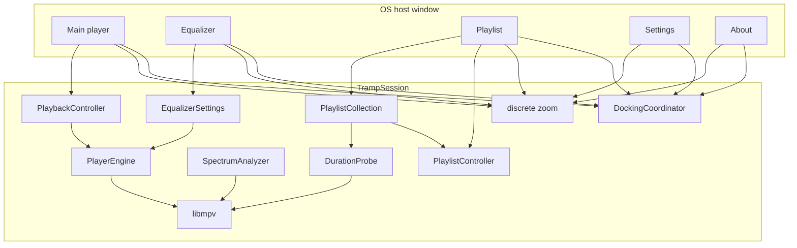

# Tramp architecture

Living map of how Tramp is structured. Domain terms: [`CONTEXT.md`](../CONTEXT.md). Product scope: [`tramp-v1-spec.md`](tramp-v1-spec.md).

## Host

**Qt 6 C++** is the only build. One process, one frameless **host window**, five **panel** views, QWidget + QPainter in [`src/`](../src/). Binary: `build/tramp`.

`TrampSession` owns playback (libmpv), playlist/collection, EQ, spectrum, docking, zoom, skins, and persistence. Panels are views onto that session, not extra engines or extra OS windows. Title-bar drags are app-owned: main translates the cluster inside the host; other panels move alone. No skip-taskbar transients, no pin-against-recenter. Host geometry is the virtual desktop (bounding rect of every screen); it does not resize on panel drag; input is punched to panel shapes so the desktop is clickable in the gaps. `--dump-chrome` writes 1× logical PNGs from `SessionView::golden()`.

Linux + Windows are the pairing hosts; macOS follows.

## Product shape (v1)

- Desktop player (Windows, Linux, macOS); official download `https://tramp.music`; GPL-3.0-or-later
- Windows Store MSIX **and** website EXE; Linux Flathub **and** AppImage; Mac notarized DMG later
- Custom **app chrome**; five **panels** inside one host window — main/EQ/PL dock; settings and about freestanding; host shape
- Main title-bar drag translates all panels inside the host; other title-bar drags move only that panel. EQ/PL snap on drag end; settings stays raised among panels; taskbar shows the host (Tramp)
- Fixed canvases: main/EQ **825×348**, playlist default **1073×696** (free resize), settings **520×420**, about **480×360**; global discrete zoom
- Code-constructed mockup chrome; recolor **skins**; no classic WSZ in v1
- Full libmpv; playlist-centric M3U/M3U8; no media library
- UI authority: `player-mockup-2.html` plus the redesign / polish design docs

## Distribution

CI-built. Workflows and secrets: [`distribution.md`](distribution.md). macOS DMG waits on the Qt Mac host. In-app update follows **install channel**.

## System

## Modules (`src/`)

| Area | Owns |
|------|------|
| Host | `HostShell` (`host_shell_window.*`) + five `HostWindow` panels — one frameless host window titled Tramp, sized to the virtual desktop; taskbar/dock/pager icon from `assets/branding/app_icon.png` (`app_icon.*`); punched input from child panel rects (never an empty mask while mapped); main close persists then quits; extra panels hide |
| Session | `session.*`, `session_view.*` — shared controllers, commands, `--dump-chrome` golden. OS wait cursor (`wait_cursor.*`) during sync UI-thread loads (skin change/install, playlist file ingest, collection add, Refresh, bootstrap JSON load). Playlist Refresh also keeps the Refresh button’s on-face for that same span (`SessionView::playlistRefreshing`). Not during spectrum, background path-verify, background probe of dropped audio files, or playback. |
| Docking | `docking.*` — peel 8 logical px; EQ and playlist any side and both axes (two neighbors); settings/about never snap. Title-bar drags are app-owned. Child drags move one panel in host-local space; main drag translates the cluster. `placePanels` uses `mapToGlobal` origin and does not resize the host unless the virtual desktop changed. Panels stay fully on the virtual desktop. |
| Chrome | `chrome_paint.cpp`, `chrome_bodies.cpp`, `chrome_hits.cpp`, `chrome_layout.h`, `title_chrome.*`, `mockup_draw.cpp`, `mockup_tokens.h`, `tramp_metrics.h`, `tramp_fonts.*` — mockup `.win` / `.tbar` / `.wbtn` at discrete zoom (default 75%). Main title-bar: zoom cluster, then minimize flush to close. Display-well STEREO/PLAYLIST keep a fixed gap; overflowing track/album lines marquee on the live pass when Scroll title is on (static titles stay on the chassis); close buttons take hue from the more saturated of skin ink vs accent. EQ response curve (fill, glow, stroke) is clipped to the curve well. |
| Skins | `look.*` — `skin.json` / legacy `look.json`; embedded **Tramp** (id `builtin`) plus bundled homage packs under `skins/` (Arc, Shield, Thunder, Gamma, Widow, Marksman, Mind); catalog `<support>/skins`. Settings Skins tab is a clipped scrolling list. Playlist track-list CRT wash (`listWash*`) is the mockup `.list` radial, hue-walked through the skin phosphor so builtin stays cyan and homage skins keep the same bloom; CRT `screenWash*` stays a separate display-well token. |
| Playback | `playback.*`, `player_engine.h`, `mpv_engine.*`, `transport.*` — libmpv `vo=null`; playing **path** not index; stop unloads media. Next/Prev/shuffle skip **disabled tracks**; Play / double-click do not open them. |
| EQ / mono | `equalizer.*` — lavfi `af`; On / Auto / Presets; ±12 dB; force-mono via `audio-channels` |
| Spectrum | `spectrum.*`, `stft.*`, `pcm_decoder.*`, `wav_reader.*` — 20 log bands (40 Hz–Nyquist, 4096-point STFT, unique FFT bins per bar) from a throwaway `ao=pcm` pass; honest silence until ready |
| Playlist | `playlist.*`, `m3u.*` — M3U/M3U8; multi-select; reorder; sort; resolve track lines as hints on **add** and **Refresh** only. Clicking a saved playlist paints from `playlist_tracks.json` (no wait cursor). Refresh icon sits to the right of TOTAL. Track-list scrollbar paints only when rows overflow the well. |
| Collection | `collection.*` — references, not copies; disabled left-rows when the playlist file is gone (still loadable from cache). On add / Refresh / Save, times and tag titles are written to the cache. Click does not rewrite the cache. About **TOTAL TIME** only reads `readFigures()`. |
| Duration probe | `duration_probe.*` — WAV header first, then a throwaway libmpv `ao=null` pass for other kinds. Add and Refresh wait until the cache is filled; dropped audio files still probe in the background without a wait cursor. |
| Persistence | `persist.*`, `settings.*`, `support_dir.*`, `files.*` — see below |
| File chooser | `native_file_dialog.*` — host OS picker (xdg-desktop-portal FileChooser on Linux → Dolphin/Nautilus; native `QFileDialog` on Windows/macOS). Folder pick is `OpenFile` + `directory`. kdialog, then a non-native Qt widget dialog, only if the portal is unavailable. Drops leaked Qt 4/5 `QT_PLUGIN_PATH` (Cursor AppImage) before `QApplication`. |
| Libmpv bundle | `third_party/libmpv` pins + fetch; Windows DLL / Linux staged `.so` |

**Playback vs selection.** `playingIndex` / path is not the playlist highlight. Reorder re-derives the index without re-opening. `playPause` opens the selected row when nothing is open or selection differs from the playing track. Loading another saved playlist does not stop the open file and does not clear the main display: now-playing metadata stays until a new track is opened (double-click). `playingIndex` is empty while that file is not in the shown list.

**Quit.** Main close writes resume + spins, then exits. Persist during the session (debounced), not on teardown. Altered current playlist is kept continuously.

## Persistence

Support dir: `$XDG_DATA_HOME/com.proximamagnifica.tramp` (adopts legacy `…/tramp` when that is where the data already is). Reset Settings rewrites `settings.json` only.

| File | What |
|------|------|
| `settings.json` | Zoom, window frames, EQ, skins, prefs (including elapsed/remain and scroll title) |
| `session_resume.json` | Last transport / playlist origin |
| `playlists.json` + `playlist_tracks.json` | Collection index + track-set cache (playlist → paths; path → times and tag titles). Clicking a saved playlist loads this file, not the M3U. |
| `altered_playlist.json` | Unsaved current list (survives restart) |
| `usage.json` | Lifetime **spins** |

## Known v1 gaps

- Mockup fidelity / `--dump-chrome` vs `player-mockup-2.html` still hardening
- Full libmpv packaging on macOS; Linux AppImage Qt/lib bundling still hardening
- Linux MPRIS; second-instance “Open with”
- Qt macOS host (and therefore the notarized DMG)
- Spectrum: second `ao=pcm` pass per open; long tracks analyse in the background
- Title-bar drag still punches and live-paints every move; a deferred-punch trial left trails on KWin — [`title-bar-drag.md`](agents/title-bar-drag.md)

## Notes

- Fidelity is mockup-absolute at 100%. No PNG graphite faces. No Material ink.
- Tests that assert text must load Tramp Condensed / Tramp Mono.
- Version is [`VERSION`](../VERSION) (CMake `PROJECT_VERSION`, About readout).

