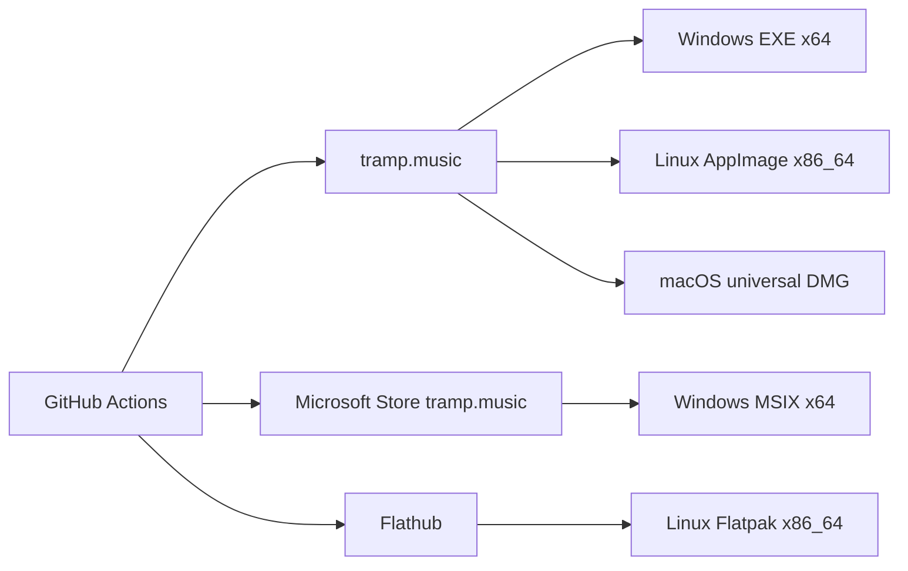
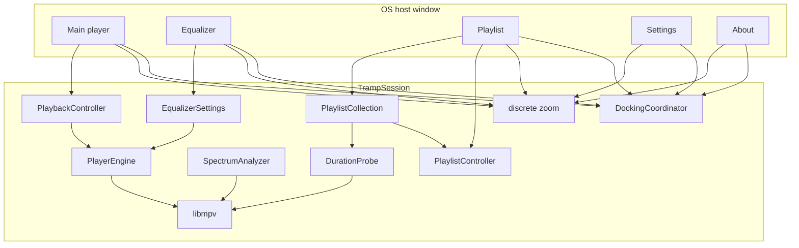

# Tramp architecture

Living map of how Tramp is structured. Domain terms: [`CONTEXT.md`](../CONTEXT.md). Product scope: [`tramp-v1-spec.md`](tramp-v1-spec.md).

## Host

**Qt 6 C++** is the only build. One process, one frameless **host window**, five **panel** views, QWidget + QPainter in [`src/`](../src/). Binary: `build/tramp`.

`TrampSession` owns playback (libmpv), playlist/collection, EQ, spectrum, docking, zoom, skins, and persistence. Panels are views onto that session, not extra engines or extra OS windows. Title-bar drags are app-owned: main translates the cluster inside the host; other panels move alone. No skip-taskbar transients, no pin-against-recenter. Host geometry is the virtual desktop (bounding rect of every screen); it does not resize on panel drag; input is punched to panel shapes so the desktop is clickable in the gaps. `--dump-chrome` writes 1× logical PNGs from `SessionView::golden()`.

Linux + Windows are the pairing hosts; macOS follows.

## Product shape (v1)

- Desktop player (Windows, Linux, macOS); official download `https://tramp.music`; GPL-3.0-or-later
- Windows Store MSIX **and** website EXE; Linux Flathub **and** AppImage; Mac notarized DMG later
- Custom **app chrome**; five **panels** inside one host window — main/EQ/PL dock; settings and about freestanding; host shape
- Main title-bar drag translates all panels inside the host; other title-bar drags move only that panel. EQ/PL snap on drag end; settings stays raised among panels; taskbar shows the host (Tramp)
- Fixed canvases: main/EQ **825×348**, playlist default **1073×696** (free resize), settings **520×420**, about **480×360**; global discrete zoom
- Code-constructed mockup chrome; recolor **skins**; no classic WSZ in v1
- Full libmpv; playlist-centric M3U/M3U8; no media library
- UI authority: `player-mockup-2.html` plus the redesign / polish design docs

## Distribution

CI-built. Workflows and secrets: [`distribution.md`](distribution.md). macOS DMG waits on the Qt Mac host. In-app update follows **install channel**.

**Every download carries its own Qt.** Windows stages it with `windeployqt`; Linux has no equivalent, so `packaging/linux/stage_bundle.sh` is it — one staging path (`build/linux/bundle`) that the tarball, the AppImage and the Flatpak all read, so they cannot drift. It deploys the Qt the binary was *linked against* (asked of the build-tree binary, before CMake rewrites its RPATH), takes the `platforms`, `platformthemes`, `imageformats`, `xcbglintegrations`, `platforminputcontexts` and `wayland-*` plugin groups whole, walks `DT_NEEDED` to a closure, and rewrites every runpath to `$ORIGIN` with `patchelf`. The host keeps only the loader, the C/C++ runtimes and the GL stack — those track the kernel and the GPU. A plugin that wants Quick, Qml, Pdf, Svg, GTK or KDE Frameworks is declined: tramp paints its own chrome, and taking one drags the whole stack in behind it.

## System

## Modules (`src/`)

| Area | Owns |
|------|------|
| Audio backend | `TRAMP_HAVE_MPV` turns on via `pkg-config mpv`, the bundled Linux `.so`, or the Windows import library plus DLL that `tool/fetch_full_libmpv.ps1` stages under `third_party/libmpv/windows/x86_64`. Windows needs **both** files: the import library is what links, the DLL is what ships — and what the loader resolves at process start, so CMake copies it beside `tramp.exe` and `domain_test.exe` in the build tree as well as into the package. Configuring without an engine is a **hard error** unless `-DTRAMP_ALLOW_NO_AUDIO=ON`; no workflow passes that, so a silent build cannot be packaged. |
| Host | `HostShell` (`host_shell_window.*`) + five `HostWindow` panels — one frameless host window titled Tramp, sized to the virtual desktop; taskbar/dock/pager icon from `assets/branding/app_icon.png` (`app_icon.*`); punched input from child panel rects (never an empty mask while mapped); main close persists then quits; extra panels hide |
| Session | `session.*`, `session_view.*` — shared controllers, commands, `--dump-chrome` golden. OS wait cursor (`wait_cursor.*`) during sync UI-thread loads (skin change/install, playlist file ingest, collection add, Refresh, bootstrap JSON load). Playlist Refresh also keeps the Refresh button’s on-face for that same span (`SessionView::playlistRefreshing`), published before `WaitCursorScope` so the cursor’s `processEvents` flush shows both together. Not during spectrum, background path-verify, background probe of dropped audio files, or playback. |
| Docking | `docking.*` — peel 8 logical px; EQ and playlist any side and both axes (two neighbors); settings/about never snap. Title-bar drags are app-owned. Child drags move one panel in host-local space; main drag translates the cluster. `placePanels` uses `mapToGlobal` origin and does not resize the host unless the virtual desktop changed. Panels stay fully on the virtual desktop — but only the ones you can see decide where the edge is: `visibleClusterMembers` keeps a hidden panel out of the union `fitClusterToHost` measures, because a hidden panel keeps the position it will reappear at and would otherwise reserve ghost space (a closed About parked left of main stopped main reaching the left of the screen). Hidden panels still ride the correction so they do not walk out of the cluster. |
| Chrome | `chrome_paint.cpp`, `chrome_bodies.cpp`, `chrome_hits.cpp`, `chrome_anim.*`, `chrome_tooltip.*`, `chrome_menu.*`, `chrome_layout.h`, `title_chrome.*`, `mockup_draw.cpp`, `mockup_tokens.h`, `tramp_metrics.h`, `tramp_fonts.*` — mockup `.win` / `.tbar` / `.wbtn` at discrete zoom (default 75%). Everything is CPU-rasterised per frame, so **paint cost is drag cost** — see [Paint budget](#paint-budget). Main title-bar: zoom cluster, then minimize flush to close. Display-well STEREO/PLAYLIST keep a fixed gap; overflowing track/album lines marquee on the live pass when Scroll title is on (static titles stay on the chassis); close buttons take hue from the more saturated of skin ink vs accent. EQ response curve (fill, glow, stroke) is clipped to the curve well. Hover labels name glyph and abbreviated buttons (`chromeTooltip` + 450 ms wait); they stay off the title-drag / punch path and stay silent on sliders, list rows, and while the wait cursor is up. Dropdowns are ours too: `execChromeMenu` is a blocking frameless `Qt::Popup` painted from the active skin (shell chassis, phosphor row lift, check gutter), anchored by `popup_anchor.h` — the options cog, EQ presets and the three playlist menus, with no platform `QMenu` left. `Qt::Popup` is deliberate: it is the one window type Qt can grab the pointer for on Wayland, and it maps to `xdg_popup`, so the compositor stacks it over the shell and dismisses it on an outside click. Buttons do not snap between states — see [Button transitions](#button-transitions). |
| Skins | `look.*` — `skin.json` / legacy `look.json`; embedded **Tramp** (id `builtin`) plus bundled homage packs under `skins/` (Arc, Shield, Thunder, Gamma, Widow, Marksman, Mind); catalog `<support>/skins`. Settings Skins tab is a clipped scrolling list. Playlist track-list CRT wash (`listWash*`) is the mockup `.list` radial, hue-walked through the skin phosphor so builtin stays cyan and homage skins keep the same bloom; CRT `screenWash*` stays a separate display-well token. |
| Playback | `playback.*`, `player_engine.h`, `mpv_engine.*`, `transport.*` — libmpv `vo=null`; playing **path** not index; stop unloads media. Next/Prev/shuffle skip **disabled tracks**; Play / double-click do not open them. mpv reports a `loadfile` failure inline from `open()`, so `playIndex` bails instead of reading as playing. With no usable backend the session installs `MissingAudioEngine`, which refuses the open with a reason — `NullEngine` is the inert test stub and reports playback, which is why it must not be the product fallback. |
| EQ / mono | `equalizer.*` — lavfi `af`; On / Auto / Presets; ±12 dB; force-mono via `audio-channels` |
| Spectrum | `spectrum.*`, `stft.*`, `pcm_decoder.*`, `wav_reader.*` — 20 log bands (40 Hz–Nyquist, 4096-point STFT, unique FFT bins per bar) from a throwaway `ao=pcm` pass; honest silence until ready. Pause and stop are not the same ending: pause stops the tick and holds the last frame, while stop and track-end keep ticking through `SpectrumHold::release` until `atRest`, so the bars fall over ~0.5 s instead of freezing mid-song. The musical `kPeakDecay` is too slow for that — it leaves peaks near the top for seconds, reading as a track still sounding. |
| Playlist | `playlist.*`, `m3u.*` — M3U/M3U8; multi-select; reorder; sort; resolve track lines as hints on **add** and **Refresh** only. Clicking a saved playlist paints from `playlist_tracks.json` (no wait cursor). Refresh icon sits to the right of TOTAL. Track-list scrollbar paints only when rows overflow the well. |
| Collection | `collection.*` — references, not copies; disabled left-rows when the playlist file is gone (still loadable from cache). On add / Refresh / Save, times and tag titles are written to the cache. Click does not rewrite the cache. About **TOTAL TIME** only reads `readFigures()`. |
| Duration probe | `duration_probe.*` — WAV header first, then a throwaway libmpv `ao=null` pass for other kinds. Add and Refresh wait until the cache is filled; dropped audio files still probe in the background without a wait cursor. |
| Persistence | `persist.*`, `settings.*`, `support_dir.*`, `files.*` — see below |
| File chooser | `native_file_dialog.*` — host OS picker (xdg-desktop-portal FileChooser on Linux → Dolphin/Nautilus; native `QFileDialog` on Windows/macOS). Folder pick is `OpenFile` + `directory`. kdialog, then a non-native Qt widget dialog, only if the portal is unavailable. Drops leaked Qt 4/5 `QT_PLUGIN_PATH` (Cursor AppImage) before `QApplication`. |
| Libmpv bundle | `third_party/libmpv` pins + fetch; Windows DLL / Linux staged `.so` |

**Playback vs selection.** `playingIndex` / path is not the playlist highlight. Reorder re-derives the index without re-opening. `playPause` opens the selected row when nothing is open or selection differs from the playing track. Loading another saved playlist does not stop the open file and does not clear the main display: now-playing metadata stays until a new track is opened (double-click). `playingIndex` is empty while that file is not in the shown list.

**Quit.** Main close writes resume + spins, then exits. Persist during the session (debounced), not on teardown. Altered current playlist is kept continuously.

## Paint budget

There is no GPU path and no PNG face cache: every panel is rasterised with `QPainter` on the UI thread. A panel drag repaints the moved panel, and a **main** drag translates the cluster, so it repaints every visible panel. Per-move cost is therefore the sum of the repaint costs of whatever is open, and the frame budget is the whole product feel.

Three things hold that budget:

- **Optimised builds are mandatory.** `build.sh` compiles `-O2`; `CMakeLists.txt` defaults `CMAKE_BUILD_TYPE` to `RelWithDebInfo`. An `-O0` build drags at a few frames per second. `--bench-chrome` fails when `__OPTIMIZE__` is absent, and both `build.sh` and CI run it as part of the gate. CMake also carries the same warning set as `build.sh`.
- **Blur is the expensive primitive.** `gaussianBlur` (`mockup_draw.cpp`) backs every glow, drop shadow and bloom, 8–18 times per full panel paint. It uses a fixed-point separable kernel, and for σ ≥ 4 a three-pass box approximation whose cost is independent of radius. `TRAMP_BLUR=exact` and `TRAMP_BENCH_NO_BLUR=1` exist for measurement.
- **Rasterised chrome is cached per panel.** Every panel keeps a `chassis_` image at widget × DPR size. Main and EQ cache `BodyPaint::chassis` and paint `BodyPaint::live` (clock, spectrum, seek, EQ curve) on top each frame; playlist, settings and about have no per-frame content, so their whole `BodyPaint::full` paint is the cache. A move therefore costs one `drawImage`. The cache is keyed on buffer size as well as the invalidation flag, so a resize cannot show stale pixels even if a call site forgets to invalidate. `SessionView::goldenDemo` bypasses the cache — that path is the fidelity reference.

Blurred well bloom / inner shade are cached per well size in a **bounded** most-recent-first cache (`cachedWell`); a resize walks a new size per step, so unbounded it grew by megabytes per gesture.

## Button transitions

`chrome_anim.*` holds an eased 0..1 phase per animated visual, keyed on `ChromeHit::Kind` (plus `TitleChromeLayout::Hit` for the title bar) and one of three channels: `on` is latched state the session owns, `hover` and `press` belong to the panel's own pointer. `drawBtn` takes a `BtnFace` of those three rather than a bool, and mixes the lit and idle faces stop by stop — they are different gradients with their middle stop in different places, not one gradient with a brighter setting. At rest the result is pixel-identical to the pre-animation chrome, which is what the fidelity gate checks.

The budget rule above says a chassis rebuild must never land on a drag. A transition rebuilds the chassis every frame, and is affordable only because **a pointer cannot hover a button and drag a panel at the same time** — `HostWindow::mouseMoveEvent` skips pointer tracking outright while a title drag or playlist resize owns the pointer. `ChromePhases::advance` steps on the wall clock, so a panel too slow for the 16 ms timer still finishes in `kBtnTransitionMs`; it just draws fewer frames. The timer stops as soon as nothing is moving.

Two carve-outs. Sliders, list rows, dividers and resize handles take no pointer feedback (`takesPointerFeedback`), because hovering a track list would re-rasterise the playlist chassis on every mouse move. And the playlist Refresh lamp snaps rather than fades: it announces work that blocks the event loop, so a fade would still be dark when the loop stopped and would only fill in once the work had already finished.

A default-constructed `ChromePhases` is **inert**. `--dump-chrome` and the panel tests paint without a live panel behind them, and painters fall back to plain session state so latched buttons still come out lit.

Measurement lives in `--bench-drag` / `--bench-resize` (synthetic gesture through the real event path, reporting per-panel repaint count and a cost split across blur, blurred-layer machinery and font builds), `tool/bench-drag-matrix.sh`, and `tool/fidelity-diff.sh` (mockup-fidelity gate for any change to drawing). Detail and history: [`title-bar-drag.md`](agents/title-bar-drag.md).

## Persistence

Support dir: `$XDG_DATA_HOME/com.proximamagnifica.tramp` (adopts legacy `…/tramp` when that is where the data already is). Reset Settings rewrites `settings.json` only.

**Writes never truncate.** `SupportStore` writes through `QSaveFile` (temporary beside the target, renamed on commit) and every write returns whether it landed, so an interrupted or refused write leaves the previous file intact. A file that exists but does not parse is moved aside as `<name>.corrupt` rather than read as defaults — returning defaults let the next debounced persist overwrite the survivors. The listener's own M3U goes through the same route (`writeM3uFile`), and a save that fails keeps the playlist marked altered and says so.

Playlist bytes are decoded by `decodeM3uBytes`: UTF-8 or UTF-16 by byte-order mark, else UTF-8, else Latin-1 — playlists written on Windows are routinely CP1252.

| File | What |
|------|------|
| `settings.json` | Zoom, window frames, EQ, skins, prefs (including elapsed/remain and scroll title) |
| `session_resume.json` | Last transport / playlist origin |
| `playlists.json` + `playlist_tracks.json` | Collection index + track-set cache (playlist → paths; path → times and tag titles). Clicking a saved playlist loads this file, not the M3U. |
| `altered_playlist.json` | Unsaved current list (survives restart) |
| `usage.json` | Lifetime **spins** |

## Known v1 gaps

- Mockup fidelity / `--dump-chrome` vs `player-mockup-2.html` still hardening
- Full libmpv packaging on macOS
- The Linux bundle carries Qt, so the Flatpak now ships one too rather than using the `org.kde.Platform` runtime's. Fat but self-consistent; a real Flathub submission would want the runtime Qt instead
- Linux MPRIS; second-instance “Open with”
- Qt macOS host (and therefore the notarized DMG)
- Spectrum: second `ao=pcm` pass per open; long tracks analyse in the background
- Playlist free resize re-rasterises per move (size change invalidates the cache), so it is bounded by raw paint cost — ~12 ms at the default size, ~25 ms at large sizes — [`title-bar-drag.md`](agents/title-bar-drag.md)
- One ~38 ms stall per second of dragging comes from committing the virtual-desktop-sized ARGB host surface, not from app painting

## Notes

- Fidelity is mockup-absolute at 100%, minus the deviations recorded here. No PNG graphite faces. No Material ink.
- Deliberate departures from `player-mockup-2.html`, so a fidelity pass does not undo them: dark wells carry `kWellRadius` (the panel corner) instead of the mockup's 3px; the main transport row and the playlist footer drop the mockup's `.rail` filler and `.plate` deck, leaving every button row on the bare shell; the mute glyph is recentred against artwork that overflows its own 24-unit viewBox (a browser hides the spill by clipping, QPainter does not).
- Tests that assert text must load Tramp Condensed / Tramp Mono.
- Version is [`VERSION`](../VERSION) (CMake `PROJECT_VERSION`, About readout).

