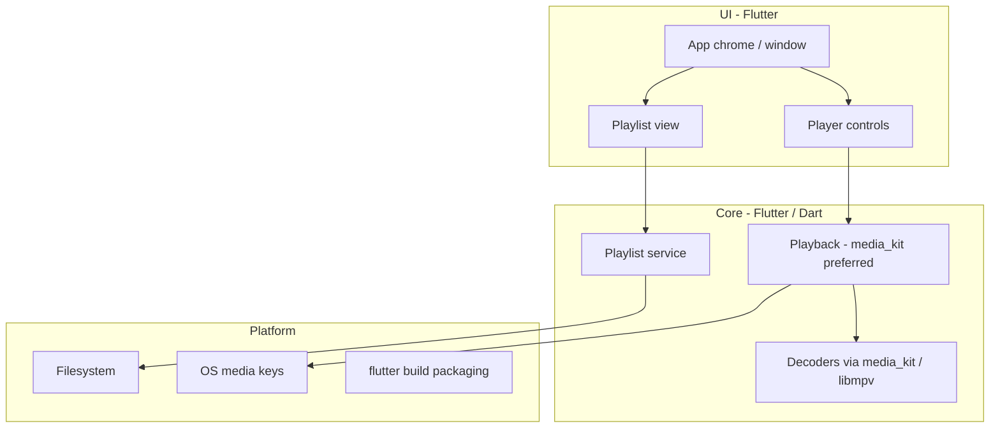

# Tramp architecture

Living design map of how Tramp is structured. Agents and humans update this whenever the app’s shape changes. Domain terms live in [`CONTEXT.md`](../CONTEXT.md); hard-to-reverse decisions live in [`docs/adr/`](adr/).

## Status

**v1 implemented.** All modules below match the shipped codebase. Product spec: [`tramp-v1-spec.md`](tramp-v1-spec.md). Stack locked (Flutter). App at repo root (`lib/`, `pubspec.yaml`, desktop runners under `windows/`, `macos/`, `linux/`). Release packaging smoke-tested on Windows (`flutter build windows`); macOS/Linux builds require those hosts.

## Intended product shape (v1)

- Multi-platform desktop player (Windows, Linux, macOS); shippable via Flutter packaging (stores not required)
- Local playback; scalable UI with custom **app chrome** (no OS window frame)
- Playlist-centric (M3U/M3U8); file associations for v1 audio + playlists; no media library in v1
- Classic Winamp skins, gapless, and crossfade: out of v1
- Product spec target: `docs/tramp-v1-spec.md`
- UI direction: transport-stack layout; paper/ink design language (see `.scratch/tramp-v1-spec/prototype/?variant=W`)

## System overview

## Modules

| Area | Responsibility | Status |
|------|----------------|--------|
| App chrome / UI | `TrampShell`, `TitleBar`, `TrampButton`, `TransportPanel`, `PlaylistPanel`, `InkSlider`; frameless resize/drag via `window_manager`; keyboard shortcuts | Implemented |
| Playback | `PlayerEngine` seam, `PlaybackController`, `MediaKitPlayerEngine` (local files via media_kit/libmpv); shuffle/repeat/volume/mute/seek | Implemented |
| Formats | MP3, AAC/M4A, FLAC, WAV, Ogg Vorbis, Opus via media_kit | Implemented |
| Playlist | Open/save M3U/M3U8, add/remove/reorder, play from selection, restore last playlist (`PlaylistController`, `M3uCodec`, `PlaylistStore`) | Implemented |
| Platform | `tramp_window` (frameless chrome); `file_open` (pickers, folder expand, DnD); `launch_args` (argv → playlist/audio); file associations (Windows registry, macOS Info.plist, Linux `.desktop`); `OsMediaControls` (Windows SMTC, macOS MPRemoteCommandCenter, Linux MPRIS stub) | Implemented |

## Stack

**Locked:** Flutter for v1 (Windows, Linux, macOS). Preferred defaults: `window_manager` (app chrome), media_kit/libmpv (playback). Not locked: state management, routing, SDK versions, design-system packages. Not v1: Tauri, Electron, second UI toolkit.

- ADR: [0001-flutter-for-v1.md](adr/0001-flutter-for-v1.md)
- Research: [`.scratch/tramp-v1-spec/research/v1-stack.md`](../.scratch/tramp-v1-spec/research/v1-stack.md)

## ADRs

- [0001 — Flutter for Tramp v1](adr/0001-flutter-for-v1.md)
