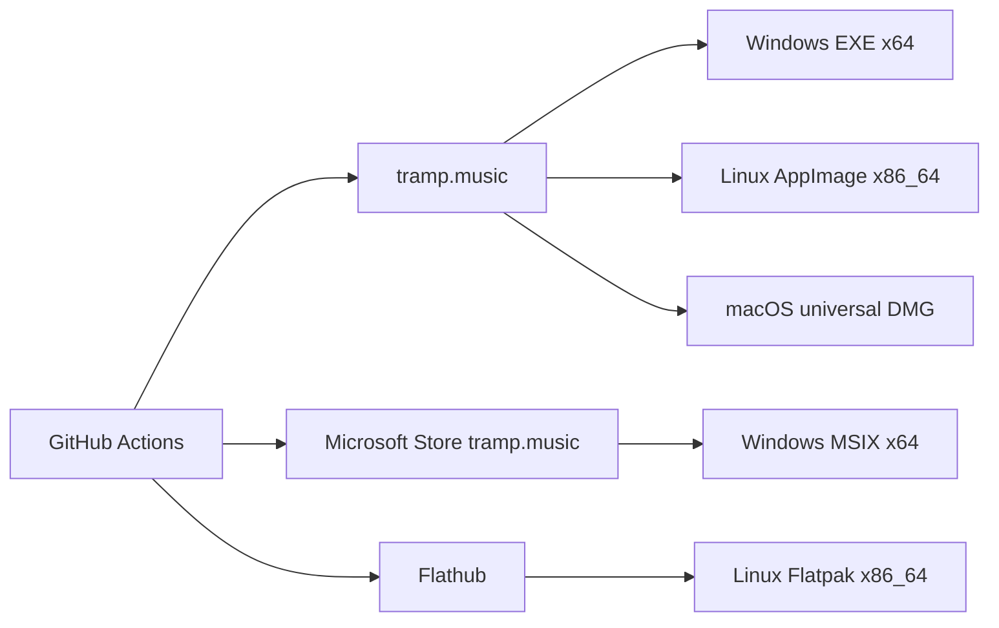
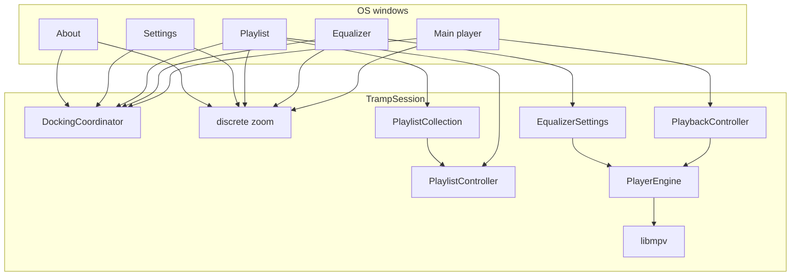

# Tramp architecture

Living design map of how Tramp is structured. Agents and humans update this whenever the app’s shape changes. Domain terms live in [`CONTEXT.md`](../CONTEXT.md); hard-to-reverse decisions live in [`docs/adr/`](adr/).

## Status

**The product host is Qt 6 C++**, not Flutter. Five frameless windows remain the product shape. Run `qt/build/tramp` (see [`qt/README.md`](../qt/README.md)). The Dart tree is **frozen** as chrome/domain reference and goldens. [`qt/src/`](../qt/src/) paints mockup chassis + live bodies with QWidget + QPainter (`startSystemMove` on the title strip, skip-taskbar extras as `Qt::Dialog` transients). `TrampSession` owns playback (libmpv), playlist/collection, EQ, docking, and persistence. `--dump-chrome` writes 1× logical PNGs from `SessionView::golden()`. See [`.scratch/qt-window-host/spec.md`](../.scratch/qt-window-host/spec.md).

## Intended product shape (v1)

- Multi-platform desktop player (Windows, Linux, macOS); **official download** from `https://tramp.music`; **GPL-3.0-or-later**; Windows Store listing **tramp.music** (MSIX) **and** website EXE ([ADR 0011](adr/0011-windows-store-and-exe.md)); Linux Flathub **and** AppImage ([ADR 0013](adr/0013-linux-flathub-and-appimage.md)); Mac notarized DMG from the site; CI-built ([ADR 0014](adr/0014-ci-and-architectures.md))
- Local playback; custom **app chrome** (no OS window frame); **five** frameless windows — main/EQ/PL with Winamp-style docking; **settings** and **about** freestanding (not snappable, not in main drag cohort) ([ADR 0006](adr/0006-multi-window-docking.md))
- Main title drag moves all **visible** EQ/PL satellites (settings/about excluded); EQ/PL drag moves self and may snap. Settings stays raised above other Tramp windows. Windows taskbar shows **main only**
- Main and EQ: fixed logical canvases (**825×348**) sized by **global** discrete zoom only; playlist freely resizes (default **1073×696** — 825 track side + 240 collection panel + 8 divider); settings fixed **520×420**; about fixed **480×360** ([ADR 0002](adr/0002-fixed-canvas-zoom.md))
- **Code-constructed** mockup chrome — not PNG graphite ([ADR 0007](adr/0007-code-constructed-mockup-chrome.md)); EQ/PL/settings/about compact titles; EQ band spectrum-gradient fill; `.wbtn` bevel chrome
- **Skins** (mockup recolor packs: `skin.json` / legacy `look.json`) managed in Settings; classic WSZ skins remain a separate concept
- **Full libmpv** bundled; media_kit remains the control seam ([ADR 0005](adr/0005-full-libmpv.md)); audible EQ (measurement-gated), real 20-bar spectrum, force-mono
- Playlist-centric (M3U/M3U8); file associations for v1 audio + playlists; no media library in v1
- Classic Winamp WSZ loading, whole-chrome “Scalable UI”, gapless, and crossfade: out of v1
- Product spec target: `docs/tramp-v1-spec.md`
- UI authority: `player-mockup-2.html` + redesign / polish design docs above

## Distribution (v1)

Release bits are CI-built ([ADR 0014](adr/0014-ci-and-architectures.md)). Workflows and secrets: [`distribution.md`](distribution.md). tramp.music is the product page and hosts the unsigned Windows EXE, AppImage, and notarized DMG. The Windows EXE installs the VC++ x64 runtime when it is missing; the Store MSIX declares the UWPDesktop VCLibs framework. Store and Flathub are the store-shaped exceptions. In-app update follows **install channel**.

## System overview

One **Qt process**; five frameless windows share playback, playlist, EQ, zoom, settings, and `DockingCoordinator`. Extra windows are extra views, not extra engines ([ADR 0015](adr/0015-one-engine-windows.md) still names the shape; the engine is Qt, not Flutter). The Dart `SessionHostApp` tree is the frozen reference for domain rules.

## Modules

| Area | Responsibility | Status |
|------|----------------|--------|
| Multi-window host | Five frameless OS windows in **one Qt process**. `HostWindow` + `TrampSession` (`qt/src/`). Title-bar drag is `QWindow::startSystemMove()`. Extras are `Qt::Dialog` transients of main and skip the taskbar. Main close persists resume then quits; extras hide. Minimize may hide visible secondaries. Always-on-top applies to visible tramp windows. Settings raises above other Tramp windows without stealing focus. Dart `SessionHostApp` is the frozen reference for the same rules | Implemented (Qt) |
| Session commands | `lib/ui/session/session_messages.dart`: JSON `SessionEvent` / `SessionCommand` codec still names the chrome→host actions (transport, EQ, playlist ops, skins, dock move, shade, toggle). Product host does not use `SessionBus` IPC; `SessionClientApp` + `desktop_multi_window` remain in-tree as leftover until macOS native is real | Implemented |
| Docking | Qt `qt/src/docking.*`: main title drag translates the visible EQ/PL cohort; EQ/PL peel (8 logical px) and snap only on finalize (EQ any side; playlist top/bottom only); settings/about never snap. Wayland follow is best-effort; xcb is the proven path. Dart `lib/ui/docking/` is the frozen reference for the same rules ([ADR 0006](adr/0006-multi-window-docking.md)) | Implemented (Qt) |
| App chrome / UI | **Qt host:** `qt/src/` paints mockup `.win` / `.tbar` / `.wbtn` plus live main/EQ/playlist/settings/about bodies at discrete zoom (default 75%). Title collapse shades extras; extra close hides; EQ/PL/options cog toggle windows. `--dump-chrome` writes 1× logical PNGs from `SessionView::golden()`. Dart `lib/ui/chrome/mockup/` is the frozen reference ([ADR 0007](adr/0007-code-constructed-mockup-chrome.md)). Flutter goldens stay Linux until Qt chrome is the fidelity bar. | Implemented |
| Theme / tokens | `MockupTokens` + `TrampMetrics` (825×348 / 825×348 / 1073×696 playlist / 520×420 settings / 480×360 about, titleBar 42; playlist collection panel 240 default / 180 min / 8 divider, and the derived `playlistMinWithCollection` 828×280) mirror mockup `:root` / classic×3 grid. Chrome reads palette/materials/fonts via `LookScope` → `ResolvedLook` (`TrampColors` / `TrampText` / `LookPaint` for derived title-bar, `.btn`, `.wbtn`, blooms). **Skins:** `lib/look/` parse/merge/catalog/install + `LookController` (host; `activeSkinId` / `skinsDirectory`, legacy look keys on load); extra views share the same isolate so they read `LookScope` directly ([design](superpowers/specs/2026-08-09-look-pack-format-design.md)) | Implemented |
| Zoom | Global discrete zoom (eight steps 50–300%, default 75%, persisted). Main title-bar −/+ resizes all five windows (`logical × zoom`). Playlist freely resizes. Dart `ZoomedCanvas` is the frozen reference ([ADR 0002](adr/0002-fixed-canvas-zoom.md)) | Implemented (Qt) |
| Playback | `PlayerEngine` seam + `PlaybackController` (`qt/src/playback.*`) over libmpv (`MpvEngine`, `vo=null`). Shuffle/repeat/volume/mute/seek; after stop, media unloaded so next play re-opens. Format metadata for bitrate / sample rate / channels. End-of-stream counts a **spin**. Engine errors drop `playing` and media-open so a later resume re-opens. Playing **path** not index. Dart `lib/playback/` is the frozen reference | Implemented (Qt + libmpv) |
| Libmpv bundle | `LibmpvBundle.verify()` + `third_party/libmpv` pins/fetch scripts; Windows CMake replaces media_kit slim `libmpv-2.dll` with the staged full build; Linux optional bundle dir; macOS audio-full fetch documented ([ADR 0005](adr/0005-full-libmpv.md)). Debug/profile startup fails on slim marker `--disable-filters` | Partial (Windows fetch + load override + verify; macOS/Linux packaging follow-through) |
| Formats | MP3, AAC/M4A, FLAC, WAV, Ogg Vorbis, Opus via full libmpv | Implemented (formats); bundling path changing |
| Playlist | Open/save M3U/M3U8, add/remove/reorder/clear, multi-select (shift-click range · platform-modifier toggle · plain tap collapse · select-all / invert). Select-all is also the **platform chord** — Ctrl+A, Cmd+A on macOS — from `selectAllActivator()`, which reads `defaultTargetPlatform` beside the toggle-click modifier so keyboard and mouse agree on which key modifies a selection. It binds via `CallbackShortcuts` on the **current-playlist panel** rather than the window, so it always means "all tracks" and leaves the collection panel free to claim the chord for its own rows later; `CallbackShortcuts` cannot hold focus, hence the autofocus `Focus` node wrapping the panel body (confined to the playlist panel — `MockupPlaylist` mounts nowhere else). Menu and chord share one `_selectAll`, so the two routes cannot drift. Delete and Backspace drop the highlighted tracks via `removeSelectedActivators()` on the same map — both keys, because the Mac key labelled Delete is Backspace to Flutter and Forward Delete is Delete; footer button and keys share one `_removeSelected`. **drag-to-reorder** (`ReorderableListView` sharing the custom scrollbar's `ScrollController`, whole row as grip — a click never reaches the drag recognizer, so shift-click and double-tap survive — carrying **one** row per drag, since a single-proxy list cannot honestly preview more; `move` remaps the selection so the other highlights follow their tracks, and `insertBeforeIndex` is the one place Flutter's resting-index convention is translated to the controller's insert-before one, which `PlaylistOpCommand.toIndex` then carries to the host), sort (title/artist/duration/path/reverse), play from selection, restore last playlist (`PlaylistController`, `M3uCodec`, `PlaylistStore`). `M3uCodec` reads each track line as a **hint rather than an address**, because a playlist file is a document other tools and other platforms write: a line that does not land on a real file is re-read as a path relative to the playlist's own directory, longest matching tail first, so a Windows `\\server\` line and an absolute line whose mount has moved both find the tracks sitting beside the playlist while an album's `Disc 2/` stays intact. Existence is asked through an injected probe (defaulted to the filesystem, as `resolveLinuxSupportPath` does) so resolution is testable without disk, and the walk costs one probe per segment only for a line that already failed. Resolution happens on **read** — [ADR 0008](adr/0008-playlist-collection-stores-references.md) forbids the alternative, since a platform-corrected rewrite would break the same file for the machine that wrote it. Background `TrackMetadataProbe` fills missing durations for TOTAL / row times. Mockup `PlaylistWindow` + DnD enqueue; frameless free resize via corner grip + L/R/B `DragToResizeArea` → `ResizePlaylistCommand` | Implemented |
| Playlist Manager | `PlaylistWindow` is a two-panel shell: `MockupPlaylistCollectionPane` (playlist collection, left) · `PlaylistCollectionDivider` · `MockupPlaylist` (current playlist, right). The window owns the live divider width so a drag repaints on the frame it happens and reports outward debounced (120ms, like window resize); the collection panel holds its pixel width on window resize and the track list takes all slack. Collapse leaves the window rendering exactly as it did with one panel — the reopen tab overlays the track pane's gutter rather than occupying layout — and the OS minimum moves between `TrampMetrics.playlistMin` and `playlistMinWithCollection` with it. Width persists as a **logical** pixel width in `TrampSettings`, so global zoom scales it with the canvas. The panel carries **its own** add / create / rename / remove controls (`pl-collection-add` / `pl-collection-create` / `pl-collection-rename` / `pl-collection-remove`), deliberately apart from the footer's track-level pair, and paints rows (`pl-collection-row-$index`) alphabetically by display name with their track counts; the loaded row is highlighted. A **disabled playlist**'s row (paths from the snapshot's `disabledPaths`) keeps its figures but reads as unavailable — `PlaylistCollectionMissingMark` plus `MockupHoverTokens.disabledOpacity` on the row contents only, so its highlight stays readable — and its tap sends `SelectSavedPlaylistCommand` instead of a load, which is how the panel's remove control can still reach it. Loading a row while the current playlist is altered asks first (see below). **Create** is one menu control (`pl-collection-create`, lit while open — the two creates fold together because a fifth glyph does not fit the narrowest panel) offering `pl-create-from-current` and `pl-create-from-selection`; each half greys on its own, because an empty current playlist and an empty selection are different refusals. Either half opens the injected `pickSavePlaylistPath`, and only a chosen path emits a command — `CreatePlaylistFromCurrentCommand` writes the whole list through `savePlaylistFile` and so lowers the altered state, while `CreatePlaylistFromSelectionCommand` is a **sibling, not a flag**, and cannot touch `PlaylistController` at all (see Playlist collection). Cancelling changes nothing at all. Both halves gate on live current-playlist state (tracks / selection), which is why the pane sits under a `ListenableBuilder` on the current playlist as well as the collection snapshot. **Rename** (`pl-collection-rename`, greyed until a row is selected, `PlaylistCollectionRenameMark`) opens `showRenamePlaylistDialog` (`lib/ui/playlist/rename_playlist_dialog.dart`) seeded with the name the row reads; `null` back is cancel and `''` is "read the filename again", and only a non-cancel answer emits `RenameSavedPlaylistCommand`. The panel's control strip is **full** at the minimum width — further collection-level actions belong in the create menu or on the row | Implemented (shell + divider + add / create from current or selection / rename / list / load / remove / disabled rows / altered-state confirmation) |
| Playlist collection | `PlaylistCollectionController` (`lib/playlist/`) is an injectable `ChangeNotifier` over `PlaylistCollectionStore`, sibling to `PlaylistController` and deliberately **not** in the session host widget, which no test can pump. It holds `SavedPlaylist` entries (`lib/domain/`) — **references** to playlist files where the listener put them, never copies ([ADR 0008](adr/0008-playlist-collection-stores-references.md)). Entry identity is the normalized absolute path (`normalizePlaylistPath` = `p.canonicalize`, so it case-folds only on Windows); adding a path already held selects its entry instead of twinning it, and removing an entry never touches disk. `FilePlaylistCollectionStore` splits storage so startup stays flat: `playlists.json` holds only what the panel paints (path, optional name override, track count, total duration, last-seen mtime) and is read at bootstrap, while `playlist_tracks.json` (`CollectionTrackSets`) caches each entry's normalized track paths **plus a running time per distinct track path** for the deduplicated About figures, and is read lazily. Running times are keyed by track rather than by entry because a length is a property of the file, and the map is pruned to what the entries still hold on every write so tidying the collection cannot leave the file growing. Both fall back to empty on any decode failure, and a companion file written before running times existed still reads — those figures come back on the entry's next refresh. `readFigures()` builds the union **in memory at the point it is wanted**, never as a running total, because arithmetic on a total cannot subtract correctly when an entry is removed or rewritten; disabled entries count, the unsaved current playlist does not, and a track whose length is unknown counts as a track but adds no time. `figuresRevision` bumps only where a figure could have moved, so a highlight never costs a companion-file read. `session.json` is **not** extended. Reset Settings rewrites `settings.json` only, so the collection survives like installed skins do. **Validation** (`validateReferences`) is one pass over the references that the host kicks off `unawaited` at the very end of `_bootstrap` — after the windows are mapped, never on the startup path. One `FileStat` per entry answers existence and modification time in the same visit; a gone file makes its entry a **disabled playlist** and a moved mtime recomputes that entry's count, duration, and track-set entry, so only changed files are re-read. Disabled is **derived** (`disabledPaths` / `isDisabled`, a set on the controller — nothing on `SavedPlaylist`, nothing in `playlists.json`), so a returning file re-enables its entry with no listener action, and every stamp comes from one truncating helper so a launch cannot read every entry as an external edit. `resolveForLoad` re-checks a single reference on click, which is how a **disabled playlist** load stays inert instead of throwing out of the command handler. `addWritten` is `add`'s sibling for a file **Tramp has just written**: same figures and companion track set, but it *refreshes* an entry the collection already holds (keeping the listener's name override) rather than leaving stale figures to the next validation pass — the host reaches it from `CreatePlaylistFromCurrentCommand`, after `savePlaylistFile` has put the file on disk. `createFromSelection` is the module's **only** write: it encodes the tracks at the sorted selected indices (a selection is an unordered, routinely gapped `Set<int>`, so sorting is what makes the file read in the order the listener sees) to a path the listener chose, then calls `addWritten`. It is reached from `CreatePlaylistFromSelectionCommand`, and because the module holds no reference to `PlaylistController`, "the current playlist's tracks, origin, and altered state come out untouched" is structural rather than a branch — the host passes tracks and indices in and nothing can reach back. `rename` moves the `SavedPlaylist.name` override only (blank, whitespace, and null all clear it back to the filename via `copyWith(clearName:)`), re-sorts, and rewrites the index: **no file is read and none is touched**, which is why a **disabled playlist** can be renamed and why two entries may read the same display name without merging — identity is the path | Implemented (add / create from current or selection / rename / list / load / remove / validate) |
| About stats | Every figure in the About window's stats well is measured; there is no placeholder left in `lib/`. Playlists, distinct tracks, and total time come from `PlaylistCollectionController.readFigures()` → `CollectionFigures` (`lib/domain/collection_figures.dart`); **spins** come from `PlaybackController.spins`. They meet in `AboutStats` (`measured` true) on the host and paint in `AboutWindow` — the window never reaches into a controller. The host memoises the last reading and recomputes on **three** guards, each of which earns its keep: the About window must be **open** (the deduplicated figures cost a read of `playlist_tracks.json`, and the window is hidden at launch, which is what keeps that file off the startup path); `figuresRevision` must have moved (it moves on a playlist added / saved / removed / found changed on disk, and not on a row being highlighted); and `spins` must have moved (playback notifies on every position tick). `AboutStats.unmeasured` — zeros, `measured` false — is the window's default until a reading arrives, so the well can never show a figure nothing counted. `AboutStats.placeholder` survives as a **test fixture only**, kept so widget and golden tests still render a full-looking four-digit readout | Implemented |
| Spins | A **spin** is one track played through to the end. Counted in `PlaybackController._onCompleted`, the single end-of-stream hook, which is why a skip never counts however late it comes, a stop never counts, and each repeat-one pass does. The lifetime total is persisted through `UsageStore` (`lib/platform/usage_store.dart` → `usage.json`), debounced 2s the way the altered current playlist and playback resume already are, and read once at bootstrap by `loadUsage`. It is **history, not preference**: Reset Settings rewrites `settings.json` alone and so spares it, and keeping it out of settings avoids rewriting the whole preferences document every time a track ends. A missing or corrupt usage file reads as zero rather than failing startup. Quit flushes the pending count beside the resume snapshot — two small writes, no teardown | Implemented |
| Altered current playlist | A current playlist whose track list changed since it was loaded or last written whole to a file. The state lives with `PlaylistController` on the host (`altered`, deliberately with **no setter**) and is read by `PlaylistWindow` on the same isolate. Only mutation raises it — add, remove, reorder, sort, reverse, clear — and only where the list really changed, so the prompt still means something when it appears. Only `savePlaylistFile` lowers it — which is why create-from-current-playlist routes its whole-list write through it rather than around it; `setTracks` sets a fresh baseline, which is what makes a load (and a client applying a snapshot to its mirror) leave it down however often it happens. Selection and `updateTrackByPath` leave it alone — the latter runs after every load, so raising there would mark a freshly loaded playlist as changed. `PlaylistWindow` intercepts a collection row's load while altered and calls `showAlteredPlaylistDialog` (`lib/ui/playlist/altered_playlist_dialog.dart`): save and load · discard and load · cancel, with **cancel** holding the default focus so an idle Return cannot discard anything. Save writes straight to the origin when the playlist has one and opens the save dialog when it does not; a cancelled save dialog returns to the current playlist still altered rather than falling through to the load. `clear()` still drops the origin, so a save after a clear asks where to write instead of truncating the file the listener loaded from. **It survives a restart**: while the state is up, `PlaylistController` keeps the whole list — tracks plus origin — through `AlteredPlaylistStore` (`lib/playlist/altered_playlist_store.dart` → `altered_playlist.json`), armed from `notifyListeners` and debounced 2s, the same debounce the host keeps playback resume on. Nothing is written at quit, and nothing may be: Tramp `_exit`s rather than tearing windows down (see Quit). Lowering the state forgets the kept list, so a saved or newly loaded playlist cannot come back altered. On launch `restoreCurrentPlaylist` prefers the kept list and puts it back through `restoreAlteredTracks`, which **can only raise** — there is no setter and no `altered:` flag on `setTracks`, so "only a whole write lowers it" stays structural. Anything else falls through to the last-playlist path, which is a load and so stays unaltered; an unreadable kept file reads as none, costing the pile rather than the launch | Implemented (host state + snapshot + confirmation + survives restart) |
| Equalizer | Mockup EQ chrome drives `EqualizerSettings` on the host; `buildEqualizerAf` → mpv `af` lavfi equalizer. Chrome: On / Auto / Presets, live curve, preamp + ten bands ±12 dB. Dart `EqualizerController` is the frozen reference | Implemented (UI + audible sink) |
| Spectrum | Honest silence in the Qt host until a Qt analyser exists (bars stay 0 in live play; `--dump-chrome` still paints the golden demo bars). Dart `SpectrumAnalyzer` remains the reference design | Partial (Qt) |
| Mono | `MonoController` / `PlayerEngine.setForceMono` → mpv `audio-channels` `mono`/`auto`; main Mono button → settings + engine | Implemented |
| Platform | Frameless multi-window APIs; file open / DnD / launch args; settings persistence (`TrampSettings` JSON, compatible with the Dart document); `session_resume.json`; `playlists.json` + `playlist_tracks.json`; `altered_playlist.json`; `usage.json`. Support directory is pinned (`qt/src/support_dir.*`): `$XDG_DATA_HOME/com.tramp.tramp`, adopting legacy `…/tramp` when that is where the data already is. Reset Settings rewrites `settings.json` only. Secondary windows skip the taskbar | Implemented (Qt); file associations / second-instance still hardening |

## Playback vs selection

`PlaybackController` keeps **`playingIndex`** (and path) separate from playlist **`selectedIndex`**. The **path** is what it follows, so a reorder re-derives `playingIndex` without re-opening the engine — the playing track does not stutter and its mark moves with it. Transport title and OS media metadata follow the playing track; playlist row highlight follows selection. `playPause` opens the selected row when nothing is open or selection differs from the playing track. After **stop**, media is unloaded so resume re-opens the current track (media_kit unloads on stop; bare `play()` would ghost-play with no audio).

## Quit

Main close (`SessionHostApp._quit`) runs optional confirm, persists the resume snapshot and flushes the pending spin count, then `_exit`s the process (`lib/ui/session/session_quit.dart`). It does **not** await GTK/GL window destroy — that compositor teardown was multi-second on Linux when extra engines existed. Regression harness: `TRAMP_AUTO_QUIT=1` + [`tool/measure_quit_latency.sh`](../tool/measure_quit_latency.sh) (budget 500ms from quit start to process death; runs against the **release** bundle in a throwaway `HOME`, so it never reads the listener's own data). Last measured **72–79ms** across five runs on Linux release — well inside the stretch target of 200ms, and tighter than the 194–460ms spread recorded when the blocker was first cleared. Re-measure after anything new lands on the quit path; the budget exists because closing once took 4–5s.

Nothing else may be added here. Anything that has to outlive a session is persisted **during** it, debounced — that is why an altered current playlist is kept continuously rather than saved or prompted for on the way out.

## Cold start

OS windows stay unmapped until `SessionHostApp` has mounted chrome and one frame has painted (`sessionWindowShouldShow`). Linux/Windows/macOS runners must not show on the first Flutter frame — that was the black “starting session…” rectangle. Extra views are created on the same isolate (hidden until `sessionReady`); `TRAMP_SOLO_MAIN=1` skips them. On Windows the host must call `waitUntilReadyToShow` before `setSkipTaskbar` — the plugin creates `ITaskbarList` only there; skipping it is a native crash. The host also skips `hide()` on Windows (the HWND was never shown). `enableTrampWindowing()` runs before `WidgetsFlutterBinding.ensureInitialized()`.

## Known v1 gaps

- **Mockup goldens** — side-by-side mockup fidelity / platform golden sets still hardening; docking + 2026-08-09 polish (button bevel, dock rules, EQ fill, compact titles, taskbar) are implemented — see [`2026-08-09-ui-polish-docking-taskbar-design.md`](superpowers/specs/2026-08-09-ui-polish-docking-taskbar-design.md).
- **Full libmpv on macOS/Linux** — Windows fetch + CMake load override are the verified path; CI stages distro libmpv into the Linux bundle and swaps macOS audio-full xcframeworks ([ADR 0005](adr/0005-full-libmpv.md), [`distribution.md`](distribution.md)). Release smoke on those hosts is still the first real proof.
- **Linux MPRIS** — session D-Bus player not registered; in-app shortcuts/media keys when focused still work.
- **Second-instance “Open with”** — argv on cold start only; no IPC to an already-running instance.
- **macOS/Linux release smoke** — not run on the primary dev host; the Release workflow packages them.
- **Spectrum decode cost** — each open runs a second `ao=pcm` pass before frames are indexed; long tracks analyse in the background (honest silence until ready).
## Implementation notes (chrome)

These cost real time and will bite again:

- **Fidelity is mockup-absolute** — side-by-side diffs vs `player-mockup-2.html` at 100%; mismatches are defects. No Material ink splash as the visible affordance.
- **No PNG graphite faces** — `GraphiteSkin` / `assets/skin/graphite/` removed; chrome is mockup code only.
- **Panel stack / Material ancestor** — Flutter debug builds still expect a `Material` ancestor for text underlines where Material widgets remain.
- **Tests that assert text must load Tramp fonts** (Condensed / Mono per mockup). Harness fallback faces have different metrics.
- **Flutter goldens are platform-specific, and the reference platform is Linux.** The whole set is baselined on the Linux development host; Windows is only used to test builds in a VM. A golden that fails there is font rasterisation until proven otherwise, and must not be rebaselined on that host — that is what left the chrome and main-player references stale (and still carrying a removed `1.0` version pill) through the whole Playlist Manager overhaul. Regenerate with `flutter test --update-goldens <file>` on Linux, and read the new image before committing it: a reference nobody looked at is a defect with a checkmark. CI on another OS needs its own set or tolerance-based comparison. The set is 17: 7 chrome + 2 main player + 2 equalizer + 5 playlist + 1 about; `test/**/failures/` mismatch dumps are gitignored.

## Stack

**Window host:** Qt 6 C++ QWidget + QPainter in `qt/`. Product binary `tramp`. Linux + Windows pairing; Mac later. Build against system Qt (or Homebrew Qt via `qt/build.sh`); ship later via Flathub/AppImage. Frozen Flutter tree still uses CI pin **3.47.0** / Dart 3.13 (goldens, `flutter test`). Mockup chassis, title bars, live window bodies, libmpv, playlist, EQ, docking, and persistence are in the Qt host. Extras skip the taskbar as `Qt::Dialog` transients of main (Wayland has no `_NET_WM_STATE`). Dock follow is best-effort on Wayland (`startSystemMove` + `moveEvent`); xcb is the proven path.

- ADR: [0001-flutter-for-v1.md](adr/0001-flutter-for-v1.md) *(historical lock; host is Qt)*
- ADR: [0002-fixed-canvas-zoom.md](adr/0002-fixed-canvas-zoom.md) (revised — global zoom across three canvases)
- ADR: [0005-full-libmpv.md](adr/0005-full-libmpv.md)
- ADR: [0006-multi-window-docking.md](adr/0006-multi-window-docking.md)
- ADR: [0015-one-engine-windows.md](adr/0015-one-engine-windows.md)
- ADR: [0007-code-constructed-mockup-chrome.md](adr/0007-code-constructed-mockup-chrome.md)
- Design: [2026-08-09-ui-polish-docking-taskbar-design.md](superpowers/specs/2026-08-09-ui-polish-docking-taskbar-design.md)
- Superseded: [0003](adr/0003-zoom-only-window-size.md), [0004](adr/0004-png-graphite-skin.md)
- Research: [`.scratch/tramp-v1-spec/research/v1-stack.md`](../.scratch/tramp-v1-spec/research/v1-stack.md) (historical; slim-libmpv EQ limits do not constrain full libmpv)

## ADRs

- [0001 — Flutter for Tramp v1](adr/0001-flutter-for-v1.md)
- [0002 — Fixed logical canvas plus a single transform for zoom](adr/0002-fixed-canvas-zoom.md)
- [0003 — Window size only via zoom steps](adr/0003-zoom-only-window-size.md) *(superseded by 0006)*
- [0004 — PNG-first graphite skin for chrome look](adr/0004-png-graphite-skin.md) *(superseded by 0007)*
- [0005 — Full libmpv bundling](adr/0005-full-libmpv.md)
- [0006 — Multi-window docking](adr/0006-multi-window-docking.md)
- [0007 — Code-constructed mockup chrome](adr/0007-code-constructed-mockup-chrome.md)
- [0008 — Playlist collection stores references; skins stay copies](adr/0008-playlist-collection-stores-references.md)
- [0009 — Official download is the website; source stays private](adr/0009-website-distribution.md) *(superseded by 0010 on source posture)*
- [0010 — Open-source; website remains the official download](adr/0010-open-source-website-download.md)
- [0011 — Windows Store MSIX and website EXE](adr/0011-windows-store-and-exe.md)
- [0012 — GPL-3.0-or-later](adr/0012-gpl-3.md)
- [0013 — Linux Flathub and AppImage](adr/0013-linux-flathub-and-appimage.md)
- [0014 — GitHub Actions CI and v1 CPU matrix](adr/0014-ci-and-architectures.md)
- [0015 — One Flutter engine, several OS windows](adr/0015-one-engine-windows.md)
