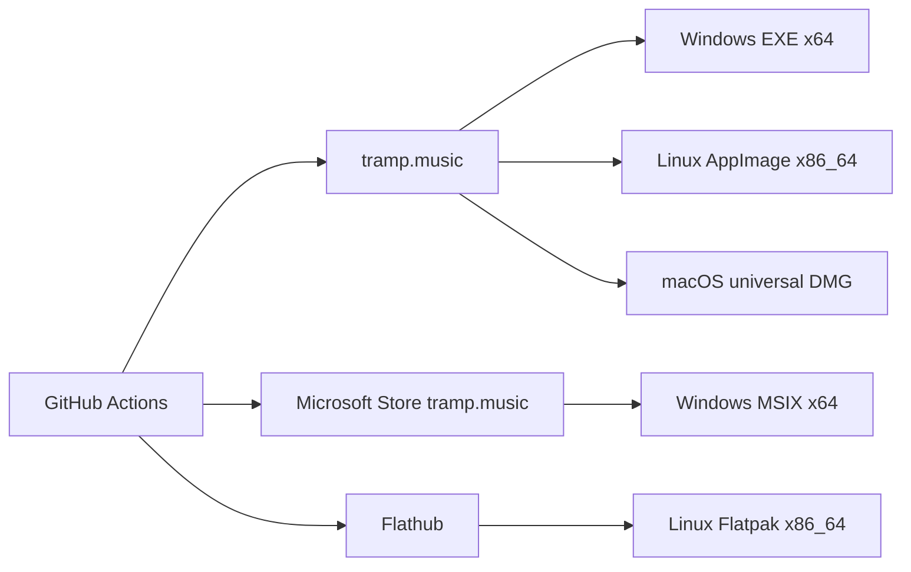
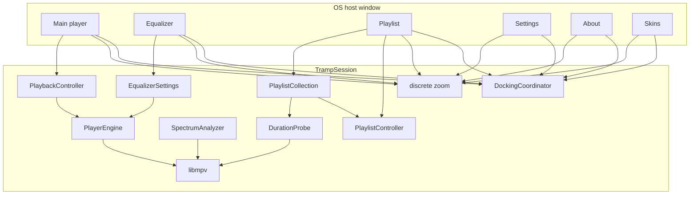

# Tramp architecture

Living map of how Tramp is structured. Domain terms: [`CONTEXT.md`](../CONTEXT.md). Product scope: [`tramp-v1-spec.md`](tramp-v1-spec.md). Which decisions are bets rather than findings: [`premises.md`](premises.md).

## Host

**Qt 6 C++** is the only build. One process, one frameless **host window**, six **panel** views, QWidget + QPainter in [`src/`](../src/). Binary: `build/tramp`.

`TrampSession` owns playback (libmpv), playlist/collection, EQ, spectrum, docking, zoom, skins, and persistence. Panels are views onto that session, not extra engines or extra OS windows. Title-bar drags are app-owned: main translates the cluster inside the host; other panels move alone. No skip-taskbar transients, no pin-against-recenter. Host geometry is the virtual desktop (bounding rect of every screen); it does not resize on panel drag; input is punched to panel shapes so the desktop is clickable in the gaps. `--dump-chrome` writes 1× logical PNGs from `goldenDemoView()`, the demo state as data the painters honour rather than a flag they override — which is what lets a caller photograph a state the demo does not open on (collapsed, clamped, and empty playlist, dead zoom-in on main, Audio tab, populated Skins panel).

Linux + Windows are the pairing hosts; macOS follows.

## Product shape (v1)

- Desktop player (Windows, Linux, macOS); official download `https://tramp.music`; GPL-3.0-or-later
- Windows Store MSIX **and** website EXE; Linux Flathub **and** AppImage; Mac notarized DMG later
- Custom **app chrome**; six **panels** inside one host window — main/EQ/PL dock; settings, about, and skins freestanding; host shape
- Main title-bar drag translates all panels inside the host; other title-bar drags move only that panel. EQ/PL snap on drag end; settings and skins stay raised among panels; taskbar shows the host (Tramp)
- Fixed canvases: main/EQ **825×348**, playlist default **1073×696** (free resize), settings **520×420**, about **480×360**, skins **520×420**; global discrete zoom
- Code-constructed mockup chrome; recolor **skins**; no classic WSZ in v1
- Full libmpv; playlist-centric M3U/M3U8; no media library
- UI authority: `player-mockup-2.html` plus the redesign / polish design docs

## Distribution

CI-built. Workflows and secrets: [`distribution.md`](distribution.md). macOS DMG waits on the Qt Mac host. In-app update follows **install channel**.

One Qt for everything that ships **and** for the local tree — the `QT_VERSION` file. That is the official desktop kit CI installs, the line `org.kde.Platform` tracks (`QT_RUNTIME` is its major.minor), and what `./tool/fetch_qt.sh` puts under `.local/qt/`. `build.sh` and CMake refuse any other version. Nothing reaches an artifact upload without being **run**: staged binary, AppImage and extracted tarball each take `--bench-chrome` and a `TRAMP_AUTO_QUIT=1` start, with the runner's Qt — libraries *and* plugins — stripped from the environment so an artifact can only use what it carries. Nothing reaches a release without being **complete**: assembly happens on every run, and it requires an EXE, an MSIX, an AppImage and a tarball before the tag-only publish step.

**Every download carries its own Qt except the Flatpak.** Windows stages it with `windeployqt`; Linux has no equivalent, so `packaging/linux/stage_bundle.sh` is it — the tarball and the AppImage read one staging path (`build/linux/bundle`) produced by one flagless run, so those two cannot drift. It deploys the Qt the binary was *linked against* (asked of the build-tree binary, before CMake rewrites its RPATH), takes the `platforms`, `platformthemes`, `imageformats`, `xcbglintegrations`, `platforminputcontexts` and `wayland-*` plugin groups whole, walks `DT_NEEDED` to a closure, and rewrites every runpath to `$ORIGIN` with `patchelf`. The host keeps only the loader, the C/C++ runtimes and the GL stack — those track the kernel and the GPU. A plugin that wants Quick, Qml, Pdf, Svg, GTK or KDE Frameworks is declined: tramp paints its own chrome, and taking one drags the whole stack in behind it.

The Flatpak is the exception, and it is the same script with `--no-qt` into its own staging path: it runs on `org.kde.Platform`, whose job is to provide Qt, so a bundled Qt would be dead weight that can shadow the runtime's. The switch lives in `stage_bundle.sh` because that script is the only thing in the repo that knows what the Qt deployment consists of — a second list somewhere else is how the two start disagreeing. libmpv and its closure still travel, because full libmpv is not something a runtime supplies.

What the **desktop** sees of the app — launcher entry, icons, and the AppStream metainfo that supplies its *name* — is `install()` rules in `CMakeLists.txt`, so `cmake --install` inside `stage_bundle.sh` carries it into all three Linux artifacts and no packaging script keeps its own list. The metainfo is load-bearing rather than cosmetic: `.desktop` `Name=` is invisible to `flatpak` and the software centres, and its absence is silent, so `tool/check-metainfo.sh` validates it and the Flatpak smoke test asserts the installed name. Details in [`distribution.md`](distribution.md).

## System

## Modules (`src/`)

| Area | Owns |
|------|------|
| Audio backend | `TRAMP_HAVE_MPV` turns on via `pkg-config mpv`, the bundled Linux `.so`, or the Windows import library plus DLL that `tool/fetch_full_libmpv.ps1` stages under `third_party/libmpv/windows/x86_64`. Windows needs **both** files: the import library is what links, the DLL is what ships — and what the loader resolves at process start, so CMake copies it beside `tramp.exe` and `domain_test.exe` in the build tree as well as into the package. Configuring without an engine is a **hard error** unless `-DTRAMP_ALLOW_NO_AUDIO=ON`; no workflow passes that, so a silent build cannot be packaged. |
| Host | `HostShell` (`host_shell_window.*`) + six `HostWindow` panels — one frameless host window titled Tramp, sized to the virtual desktop; taskbar/dock/pager icon from `assets/branding/app_icon.png` (`app_icon.*`); punched input from child panel rects (never an empty mask while mapped); always-on-top is `Qt::WindowStaysOnTopHint` plus a KWin `keepAbove` request on Plasma (`compositor_keep_above.*`) because xdg-shell has no keep-above — offscreen tests cover the flag, the script and the path it is written to, not compositor stacking. KWin opens that script **by path from its own process**, so it goes in a runtime *subdirectory* the sandbox and the host share (`--filesystem=xdg-run/tramp:create`); `loadScript` allocates an id without reading the file, so a path KWin cannot open reports success and only the discarded `run()` reply ever said otherwise; main close persists then quits; extra panels hide |
| Session | `session.*`, `session_view.*` — shared controllers, commands, `--dump-chrome` golden. `SessionView` carries the **failure-surface** flags the painters read (`spectrumUnmeasured` from the session spectrogram; `noAudioEngine` when the session installed `MissingAudioEngine`; `persistWriteFailed` until a failed state file writes). The panel table is `panelSpecs()` (`panel_registry.h`); `handleHit` dispatches through `ChromeCommandRouter`. OS wait cursor (`wait_cursor.*`) during the sync UI-thread loads — skin bootstrap, change, install and rescan, and the startup read of the collection index and the altered playlist. It does not pump the event loop: a scope is entered part-way through a session method, so a flush would run timers and queued slots against state that was half changed. Chrome published inside a scope still lands anyway, because `HostWindow` repaints synchronously while it shows. Playlist ingest raises no wait cursor at all; `SessionView::playlistRefreshing` lights the Refresh lamp for the whole of it. Nothing on a worker raises one. Spectrum decode, path verify and the async duration probe run on threads a `WorkerCrew` (`worker_crew.h`) owns and **joins**. Teardown cancels through a shared alive flag plus a generation counter per job, both consulted at every loop iteration; the join is what makes a raw session pointer legal inside a worker body. No detached threads, and no `QPointer` read off the GUI thread. |
| Docking | `docking.*` — peel is **8 logical px measured per move event**: `DockingCoordinator::move` compares the new top-left with the frame's current position, which the previous event already wrote, so only a single mouse-move that jumps that far breaks an edge (~6 native px at the 75% default). A crawl of a pixel or two per event never trips that per-event test, but it no longer keeps its edges either: `DockingCoordinator::validateEdges` runs on every `LayoutSync::place` and drops each edge whose contact has gone, so an edge lives exactly as long as the two panels it names are still flush within `kEdgeSlack` (2 native px, the slack a logical↔native round trip costs). A crawl therefore ends up undocked once it has actually left, and so does anything else that pulls panels apart — a zoom step, a clamp onto a smaller desktop — without each of those having to remember to prune edges itself. `trySnap` still skips a panel's own dock group, so nothing snaps back mid-drag. **Shift** is the immediate way out: `TrampSession::windowMoved` reads the live modifier state, drops the edges outright and suppresses the snap on drop, so the panel stays where it was put; an edgeless panel dropped inside the snap threshold is pulled flush and re-edged instead. EQ and playlist any side and both axes (two neighbors); settings/about/skins never snap. Title-bar drags are app-owned. Child drags move one panel in host-local space; main drag translates the cluster. `placePanels` uses `mapToGlobal` origin, punches to the panel union on every call, and does not resize the host unless the virtual desktop changed. Panels stay fully on the virtual desktop — but only the ones you can see decide where the edge is: `visibleClusterMembers` keeps a hidden panel out of the union `fitClusterToHost` measures, because a hidden panel keeps the position it will reappear at and would otherwise reserve ghost space (a closed About parked left of main stopped main reaching the left of the screen). Hidden panels still ride the correction so they do not walk out of the cluster. The same visible union gates the zoom ladder: `LayoutSync::zoomStepAvailable` offers a step up only while that union, scaled to the candidate step, still fits the `QScreen::availableGeometry` under its centre, and `setZoomPercent` refuses one that does not rather than trusting the caller to have asked. Callers size panels from the step the session reports, never from the step they offered. |
| Chrome | `chrome_paint.cpp`, `chrome_bodies.cpp`, `chrome_hits.cpp`, `chrome_anim.*`, `chrome_tooltip.*`, `chrome_menu.*`, `chrome_command.*`, `chrome_layout.h`, `title_chrome.*`, `mockup_draw.cpp`, `mockup_tokens.h`, `tramp_metrics.h`, `tramp_fonts.*` — mockup `.win` / `.tbar` / `.wbtn` at discrete zoom (default 75%). Everything is CPU-rasterised per frame, so **paint cost is drag cost** — see [Paint budget](#paint-budget). `handleHit` dispatches through `ChromeCommandRouter`. Empty-state copy lives on the chassis (`mainEmptyTitle`, the two playlist wells); `paintsSame` must see list emptiness or the first drop keeps a stale title. Main title-bar: zoom cluster, then minimize flush to close. A withdrawn zoom step keeps its button and drops the face: `chrome_paint` reads `SessionView::zoomInEnabled` / `zoomOutEnabled`, paints at `kWinBtnDeadLift` with drained glyph ink, and refuses hover and press; `chromeTooltip` names why — the floor of the ladder, or no room for the next percent (close a panel, or this display when both are already shut). Display-well STEREO/PLAYLIST keep a fixed gap; an unmeasured spectrum paints a small accent `UNMEAS` mark above the viz; a missing audio engine paints `NO AUDIO` there as well; a failed state-file write paints `Could not write settings` on the General tab; the Skins-panel strip remains the only skin-install surface; overflowing track/album lines marquee on the live pass when Scroll title is on (static titles stay on the chassis); close buttons take hue from the more saturated of skin ink vs accent. EQ response curve (fill, glow, stroke) is clipped to the curve well and plots the ten band gains only — preamp stays on its own fader and in the lavfi volume stage. The TRAMP wordmark is bundled Anton (`brandFont`) and ignores the skin chrome face. Hover labels name glyph and abbreviated buttons (`chromeTooltip` + 450 ms wait); they stay off the title-drag / punch path and stay silent on sliders, list rows, and while the wait cursor is up. Dropdowns are ours too: `execChromeMenu` is a blocking frameless `Qt::Popup` painted from the active skin (shell chassis, phosphor row lift, check gutter), anchored by `popup_anchor.h` — the options cog, EQ presets and the three playlist menus, with no platform `QMenu` left. `Qt::Popup` is deliberate: it is the one window type Qt can grab the pointer for on Wayland, and it maps to `xdg_popup`, so the compositor stacks it over the shell and dismisses it on an outside click. Buttons do not snap between states — see [Button transitions](#button-transitions). Hit geometry and paint geometry are single-sourced in `chrome_layout.h` — main's display, transport, seek and volume rows, the EQ header and bands, the playlist strip and the skins preview matrix. A rectangle that both a painter and a hit test need is defined once and read from both sides, which is what stops the grab drifting off the thing it grabs. `tests/host_window_move_test.cpp` is what holds it there: the painted extent of a control has to be grabbable at its edges and centre, and a per-pixel walk over each panel requires every hit region to win exactly the rectangle it hands out — sliders grab around their well, so theirs has to contain it — both checked at each end of the zoom ladder. Painter state is a contract at every layer: `mockup_draw`'s primitives, `chrome_paint`'s title helpers and `chrome_bodies`' panel painters each leave the painter exactly as they found it — pen, brush, font, render hints, clip, transform — the first two by paired `save` / `restore`, the panel painters by `PainterStateScope`, with `paintWindowBody` holding it again at the boundary as a net. Breaking it once cost the playlist footer three readouts in every shipped build. `PainterState` is the reading that checks it: pinned in `tests/chrome_spec_test.cpp`, applied in `tests/host_window_move_test.cpp` across every panel state the fidelity dump photographs, on all three passes. The net also bounds what that can see — it hides one painter's leak from every caller, which is both why the leaks cost nothing and why they went unseen for months. |
| Skins | `look.*`, `skin_preview.*` — `skin.json` / legacy `look.json`; embedded **Tramp** (id `builtin`) plus bundled homage packs under `skins/` (Arc, Shield, Thunder, Gamma, Widow, Marksman, Mind). Catalog is **`<skinsDir>` plus Tramp**; the bundled dir is a seed only (Reset folder re-seeds). Previews are golden-demo main PNGs at `<skinsDir>/.previews/<id>.png`, rebuilt if missing, replaced, pack-newer, or `kSkinPreviewGeneration` changes. The Skins panel is a clipped 2-column preview matrix (click applies; trashcan confirms delete). Playlist track-list CRT wash (`listWash*`) is the mockup `.list` radial, hue-walked through the skin phosphor so builtin stays cyan and homage skins keep the same bloom; CRT `screenWash*` stays a separate display-well token. Optional `radii.window` / `radii.surface` / `radii.button` (logical px; default 6 / 6 / 4) round panel shells, CRT wells, and chrome buttons. Window and surface radii are capped at a quarter of the shorter side of the rect they paint, so a large value cannot turn a panel or well into a pill; zero is a sharp rectangle. Buttons cap at half the shorter side. `paintsSame` treats a radii change as a chassis rebuild. |
| Playback | `playback.*`, `player_engine.h`, `mpv_engine.*`, `transport.*` — libmpv `vo=null`; playing **path** not index; stop rewinds and silences — the current track stays (title, length, format, playing index); only the spent failure message is cleared. Next/Prev/shuffle skip **disabled tracks**; Play / double-click do not open them. Auto-start and resume come in through `playFrom`, which falls through to the next playable row and names the one it skipped: they hand over an index nothing has checked, and `playIndex` on its own would answer with silence. **Shuffle** deals a fresh pass on each enable and on each repeat-all wrap, and never opens a pass on the track that just ended. A **spin** is counted only when ~90% of the running time was actually heard, so seeking past audio does not buy one. mpv reports a `loadfile` failure inline from `open()`, so `playIndex` bails instead of reading as playing — a dropped network share mid-playlist is that path (subtitle + stop), not a fourth failure-surface tier. With no usable backend the session installs `MissingAudioEngine`, which refuses the open with a reason — `NullEngine` is the inert test stub and reports playback, which is why it must not be the product fallback. The reason still lands on the panel subtitle; a durable `NO AUDIO` mark in the display well is the **persistent indicator** for the same condition. |
| EQ / mono | `equalizer.*` — lavfi `af`; On / Auto / Presets; ±12 dB; force-mono via `audio-channels` |
| Spectrum | `spectrum.*`, `stft.*`, `pcm_decoder.*`, `wav_reader.*` — 20 log bands (40 Hz–Nyquist, 4096-point STFT, unique FFT bins per bar) from a throwaway `ao=pcm` pass; honest silence until ready. Both halves cancel: the decode asks on every 50 ms wait tick, the band fold every ~2 s of audio, slicing on hop boundaries so the frames match a single whole-buffer pass. Pause and stop are not the same ending: pause stops the tick and holds the last frame, while stop and track-end keep ticking through `SpectrumHold::release` until `atRest`, so the bars fall over ~0.5 s instead of freezing mid-song. The musical `kPeakDecay` is too slow for that — it leaves peaks near the top for seconds, reading as a track still sounding. An unmeasured spectrogram (`Spectrogram::synthetic`, including the 120 s decode timeout) is a **transient notice** in the display well; the mark reads that flag on the session spectrogram, never the per-frame `AudioLevels` that go silent on pause. Cancelled loads stay unpublished. |
| Playlist | `playlist.*`, `m3u.*` — M3U/M3U8; multi-select; reorder; sort; resolve track lines as hints on **add** and **Refresh** only. Clicking a saved playlist paints from `playlist_tracks.json`. The footer Save button (left of Add) is live only while the current list is **altered**: it overwrites that list's playlist file, or opens the create-from-current picker when the list has no file yet. Refresh sits to the right of TOTAL. Track-list scrollbar paints only when rows overflow the well. An empty track well and an empty collection well (when the column is open) paint two-line copy rather than a blank CRT. |
| Collection | `collection.*` — references, not copies; disabled left-rows when the playlist file is gone (still loadable from cache). On add / Refresh / Save, times and tag titles are written to the cache, and saving garbage-collects it against the live entries so a removed playlist cannot orphan its rows. Click does not rewrite the cache. Figures count the files that are present — see **Collection figures** below. |
| Duration probe | `duration_probe.*` — WAV header first, then a throwaway libmpv `ao=null` pass for other kinds. Every ingest probes on a `WorkerCrew` worker — open, add, Refresh, Save and drop alike. Rows appear at once: a playlist ingest carries whatever the cache knew, dropped or added audio starts at `--:--`. Answers come back in batches (24 of them, or 120 ms since the last flush), so a long list is tens of repaints rather than hundreds. `stillWanted` is asked on every tick of the libmpv wait, not once per file, so teardown costs a 0.25 s tick rather than a file’s twenty-second budget. |
| Persistence | `persist.*`, `settings.*`, `support_dir.*`, `files.*` — see below |
| File chooser | `native_file_dialog.*` — host OS picker (xdg-desktop-portal FileChooser on Linux → Dolphin/Nautilus; native `QFileDialog` on Windows/macOS). Folder pick is `OpenFile` + `directory`. kdialog, then a non-native Qt widget dialog, only if the portal is unavailable. Drops leaked Qt 4/5 `QT_PLUGIN_PATH` (Cursor AppImage) before `QApplication`. |
| Path intake | `document_portal.*` — `TrampSession::openPaths` is the one door for every path from outside the app (argv, drop, pick), and it swaps document-portal **exports** for the files they stand in for before anything classifies, walks or stores them. Under a sandbox "Open with" hands over an export under `$XDG_RUNTIME_DIR/doc`, and one made for a launch lives only in the portal service's memory: it outlives the process it was given to — so it reads as durable — and dies with the service at logout, leaving a persisted row dead although the file never moved. The `user.document-portal.host-path` xattr is the way back. A directory is swapped before it is walked and an M3U before it is parsed, so expanded and relative entries come out durable too. Swapping only when the origin is *readable* is what keeps this correct under a narrowed sandbox: there the export is the only handle there is, and a host path nothing can open would be worse. |
| Libmpv bundle | `third_party/libmpv` pins + fetch; Windows DLL + import library / Linux staged `.so` |

**Playback vs selection.** `playingIndex` / path is not the playlist highlight. Reorder re-derives the index without re-opening. `playPause` opens the selected row when nothing is open or selection differs from the playing track. Loading another saved playlist does not stop the open file and does not clear the main display: now-playing metadata stays until a new track is opened (double-click). `playingIndex` is empty while that file is not in the shown list.

**Collection figures.** The About stats well is headed ON THIS MACHINE, so the figures count the files that are on it — which means a stat per track the collection references, thousands of them, over a share that may have dropped. That pass runs only where an event has already changed the answer: whole-collection at bootstrap, and bounded to the one list the caller has just read on add, Refresh and Save. Never from a getter. `readFigures` is a pure read of what the last pass found, so no repaint and no probe callback can set a filesystem sweep going. The figures can therefore sit seconds behind the disk; the trade is that reading them never touches it. The cheap counterpart — are the *playlist files* still there, one question per entry — is refreshed on read instead, which is how a playlist deleted or restored mid-session is noticed without a restart.

**Quit.** Main close writes resume + spins, waits for the background workers to notice they have been cancelled — one tick each, 50 ms for a spectrum decode and a quarter second for a probe inside its libmpv wait — then exits. Persist during the session (debounced), not on teardown. Altered current playlist is kept continuously.

## Paint budget

There is no GPU path and no PNG face cache: every panel is rasterised with `QPainter` on the UI thread. A panel drag repaints the moved panel, and a **main** drag translates the cluster, so it repaints every visible panel. Per-move cost is therefore the sum of the repaint costs of whatever is open, and the frame budget is the whole product feel.

Three things hold that budget:

- **Optimised builds are mandatory.** `build.sh` compiles `-O2`; `CMakeLists.txt` defaults `CMAKE_BUILD_TYPE` to `RelWithDebInfo`. An `-O0` build drags at a few frames per second. `--bench-chrome` fails such a build **by name**, because the millisecond budgets underneath do not catch it — an `-O0` full paint measures ~38 ms against a 120 ms budget and passes. The named guard is `__OPTIMIZE__` on GCC and Clang, and `NDEBUG` on MSVC, which predefines no optimisation macro of its own; every Windows build here comes from CMake, which pairs `NDEBUG` with `/O2` or `/O1` outside Debug. Because that guard is compiler-specific, CI runs the gate on **both** runners; a Linux-only step is what let a Windows binary that failed it reach a release job. `build.sh` runs the same gate. CMake also carries the same warning set as `build.sh`.
- **Blur is the expensive primitive.** `gaussianBlur` (`mockup_draw.cpp`) backs every glow, drop shadow and bloom, 8–18 times per full panel paint. It uses a fixed-point separable kernel, and for σ ≥ 4 a three-pass box approximation whose cost is independent of radius. `TRAMP_BLUR=exact` and `TRAMP_BENCH_NO_BLUR=1` exist for measurement.
- **Rasterised chrome is cached per panel.** Every panel keeps a `chassis_` image at widget × DPR size. Main and EQ cache `BodyPaint::chassis` and paint `BodyPaint::live` (clock, spectrum, seek, EQ curve) on top each frame; playlist, settings, about and skins have no per-frame content, so their whole `BodyPaint::full` paint is the cache. A move therefore costs one `drawImage`. The cache is keyed on buffer size as well as the invalidation flag, so a resize cannot show stale pixels even if a call site forgets to invalidate. `SessionView::goldenDemo` bypasses the cache — that path is the fidelity reference.

Blurred well bloom / inner shade are cached per well size in a **bounded** most-recent-first cache (`cachedWell`); a resize walks a new size per step, so unbounded it grew by megabytes per gesture.

## Button transitions

`chrome_anim.*` holds an eased 0..1 phase per animated visual, keyed on `ChromeHit::Kind` (plus `TitleChromeLayout::Hit` for the title bar) and one of three channels: `on` is latched state the session owns, `hover` and `press` belong to the panel's own pointer. `drawBtn` takes a `BtnFace` of those three rather than a bool, and mixes the lit and idle faces stop by stop — they are different gradients with their middle stop in different places, not one gradient with a brighter setting. At rest the result is pixel-identical to the pre-animation chrome, which is what the fidelity gate checks.

The budget rule above says a chassis rebuild must never land on a drag. A transition rebuilds the chassis every frame, and is affordable only because **a pointer cannot hover a button and drag a panel at the same time** — `HostWindow::mouseMoveEvent` skips pointer tracking outright while a title drag or playlist resize owns the pointer. `ChromePhases::advance` steps on the wall clock, so a panel too slow for the 16 ms timer still finishes in `kBtnTransitionMs`; it just draws fewer frames. The timer stops as soon as nothing is moving.

Two carve-outs. Sliders, list rows, dividers and resize handles take no pointer feedback (`takesPointerFeedback`), because hovering a track list would re-rasterise the playlist chassis on every mouse move. Skins preview cells and their trashcans do take it, so the hover highlight can paint. And the playlist Refresh lamp snaps rather than fades on the `on` channel: it tracks an ingest rather than a press on that button, and an ingest can be over inside `kBtnTransitionMs`, so an eased phase would give the short ones a dim blip instead of a lamp. Hover and press still fade there like anywhere else.

A default-constructed `ChromePhases` is **inert**. `--dump-chrome` and the panel tests paint without a live panel behind them, and painters fall back to plain session state so latched buttons still come out lit.

Measurement lives in `--bench-drag` / `--bench-resize` (synthetic gesture through the real event path, reporting per-panel repaint count and a cost split across blur, blurred-layer machinery and font builds), `tool/bench-drag-matrix.sh`, and `tool/fidelity-diff.sh` (mockup-fidelity gate for any change to drawing). Detail and history: [`title-bar-drag.md`](agents/title-bar-drag.md).

## Persistence

Support dir: `$XDG_DATA_HOME/com.proximamagnifica.tramp` (adopts legacy `…/tramp` when that is where the data already is). Reset Settings rewrites `settings.json` only.

**Writes never truncate.** `SupportStore` writes through `QSaveFile` (temporary beside the target, renamed on commit) and every write returns whether it landed, so an interrupted or refused write leaves the previous file intact. `persistNow` (and the usage / altered timers) feed those bools into `PersistHealth`: a failed file stays failed until that file writes, and `SessionView::persistWriteFailed` is the **persistent indicator** painted on the Settings General tab. A file that exists but does not parse is moved aside as `<name>.corrupt` rather than read as defaults — returning defaults let the next debounced persist overwrite the survivors. The listener's own M3U goes through the same route (`writeM3uFile`), and a save that fails keeps the playlist marked altered and says so (a **modal**).

Playlist bytes are decoded by `decodeM3uBytes`: UTF-8 or UTF-16 by byte-order mark, else UTF-8, else Latin-1 — playlists written on Windows are routinely CP1252.

| File | What |
|------|------|
| `settings.json` | Zoom, window frames, EQ, skins, prefs (including elapsed/remain and scroll title) |
| `session_resume.json` | Last transport / playlist origin |
| `playlists.json` + `playlist_tracks.json` | Collection index + track-set cache (playlist → paths; path → times and tag titles), keyed on absolute paths so a collection written from one working directory still finds its tracks from another. Clicking a saved playlist loads this file, not the M3U. Save prunes the cache to the playlists still in the collection. |
| `altered_playlist.json` | Unsaved current list (survives restart) |
| `usage.json` | Lifetime **spins** |

## Known v1 gaps

- Mockup fidelity / `--dump-chrome` vs `player-mockup-2.html` still hardening
- Full libmpv packaging on macOS
- The Flatpak takes Qt from its runtime but still bundles libmpv's whole closure, so it carries copies of libraries `org.kde.Platform` also ships and could shadow them. Removing Qt was the shadowing risk worth closing first; trimming the rest needs a list of what the runtime provides
- Linux MPRIS; second-instance “Open with”
- Qt macOS host (and therefore the notarized DMG)
- Spectrum: second `ao=pcm` pass per open; long tracks analyse in the background, and a quit cancels that analysis rather than waiting it out
- Playlist free resize re-rasterises per move (size change invalidates the cache), so it is bounded by raw paint cost — ~12 ms at the default size, ~25 ms at large sizes — [`title-bar-drag.md`](agents/title-bar-drag.md)
- One ~38 ms stall per second of dragging comes from committing the virtual-desktop-sized ARGB host surface, not from app painting
- **Mixed device pixel ratios across a multi-head desktop are untested, and accepted as such for v1.** Logical↔native conversion runs off the zoom percent alone, while `HostWindow` takes `devicePixelRatioF()` from the widget — one value for a host surface that spans every display. A panel dragged onto a display with a different ratio would therefore rasterise at the other display's scale. The layout stays correct; the chrome would read soft or oversized. Nobody on the project has a mixed-ratio pair to reproduce it on, so a speculative fix would be untestable in both directions
- **Non-rectangular monitor arrangements (an L, or a stack of unequal heights) are treated as their bounding box, and accepted as such for v1.** `hostRect` is one rectangle, so `fitClusterToHost` can pull a cluster into a part of that rectangle no display actually covers, and `workAreaFor` answers from whichever screen is under the cluster's centre. Panels would land on dead space rather than out of bounds. The fix is per-screen fitting rather than a bounding box; it is not worth the geometry until there is an arrangement here to verify it against

## Notes

- Fidelity is mockup-absolute at 100%, minus the deviations recorded here. No PNG graphite faces. No Material ink.
- Deliberate departures from `player-mockup-2.html`, so a fidelity pass does not undo them: dark wells default to the panel corner (`radii.surface` / `kWellRadius`, 6) instead of the mockup's 3px; the main transport row and the playlist footer drop the mockup's `.rail` filler and `.plate` deck, leaving every button row on the bare shell; the mute glyph is recentred against artwork that overflows its own 24-unit viewBox (a browser hides the spill by clipping, QPainter does not); the TRAMP wordmark is bundled Anton rather than the mockup's tracked Tramp Condensed, and skins cannot restyle that face.
- Tests that assert text must load Tramp Condensed / Tramp Mono. Wordmark tests also need bundled Anton.
- Version is [`VERSION`](../VERSION) (CMake `PROJECT_VERSION`, About readout).

