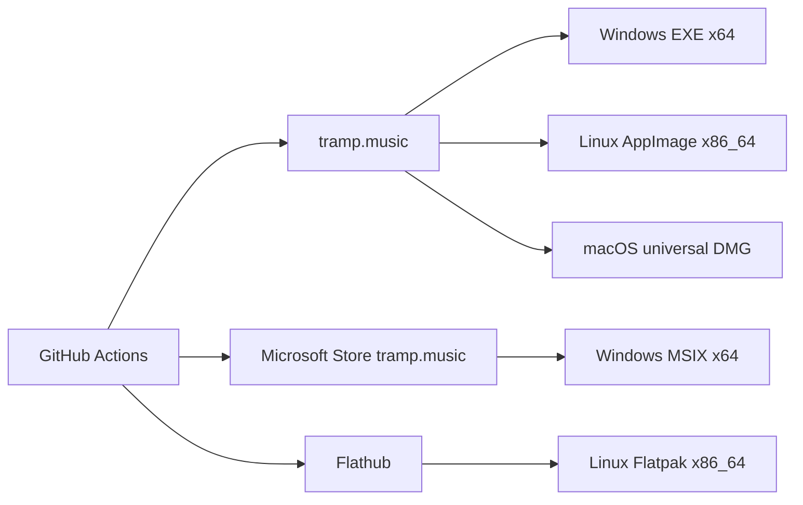
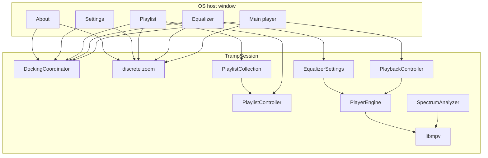

# Tramp architecture

Living map of how Tramp is structured. Domain terms: [`CONTEXT.md`](../CONTEXT.md). Hard-to-reverse decisions: [`docs/adr/`](adr/). Product scope: [`tramp-v1-spec.md`](tramp-v1-spec.md).

## Host

**Qt 6 C++** is the only build ([ADR 0016](adr/0016-qt-for-v1.md)). One process, one frameless **host window**, five **panel** views, QWidget + QPainter in [`src/`](../src/). Binary: `build/tramp`.

`TrampSession` owns playback (libmpv), playlist/collection, EQ, spectrum, docking, zoom, skins, and persistence. Panels are views onto that session, not extra engines or extra OS windows. Title-bar drags are app-owned: main translates the cluster inside the host; other panels move alone. No skip-taskbar transients, no pin-against-recenter. Host geometry is the virtual desktop (bounding rect of every screen); it does not resize on panel drag; input is punched to panel shapes so the desktop is clickable in the gaps ([ADR 0017](adr/0017-one-host-window-internal-panels.md), [ADR 0019](adr/0019-virtual-desktop-punched-host.md)). `--dump-chrome` writes 1× logical PNGs from `SessionView::golden()`.

Linux + Windows are the pairing hosts; macOS follows.

## Product shape (v1)

- Desktop player (Windows, Linux, macOS); official download `https://tramp.music`; GPL-3.0-or-later
- Windows Store MSIX **and** website EXE ([ADR 0011](adr/0011-windows-store-and-exe.md)); Linux Flathub **and** AppImage ([ADR 0013](adr/0013-linux-flathub-and-appimage.md)); Mac notarized DMG later
- Custom **app chrome**; five **panels** inside one host window — main/EQ/PL dock; settings and about freestanding ([ADR 0006](adr/0006-multi-window-docking.md); host shape [ADR 0017](adr/0017-one-host-window-internal-panels.md), [ADR 0019](adr/0019-virtual-desktop-punched-host.md))
- Main title-bar drag translates all panels inside the host; other title-bar drags move only that panel. EQ/PL snap on drag end; settings stays raised among panels; taskbar shows the host (Tramp)
- Fixed canvases: main/EQ **825×348**, playlist default **1073×696** (free resize), settings **520×420**, about **480×360**; global discrete zoom ([ADR 0002](adr/0002-fixed-canvas-zoom.md))
- Code-constructed mockup chrome ([ADR 0007](adr/0007-code-constructed-mockup-chrome.md)); recolor **skins**; no classic WSZ in v1
- Full libmpv ([ADR 0005](adr/0005-full-libmpv.md)); playlist-centric M3U/M3U8; no media library
- UI authority: `player-mockup-2.html` plus the redesign / polish design docs

## Distribution

CI-built ([ADR 0014](adr/0014-ci-and-architectures.md)). Workflows and secrets: [`distribution.md`](distribution.md). macOS DMG waits on the Qt Mac host. In-app update follows **install channel**.

## System

## Modules (`src/`)

| Area | Owns |
|------|------|
| Host | `HostShell` (`host_shell_window.*`) + five `HostWindow` panels — one frameless host window titled Tramp, sized to the virtual desktop; punched input from child panel rects; main close persists then quits; extra panels hide |
| Session | `session.*`, `session_view.*` — shared controllers, commands, `--dump-chrome` golden |
| Docking | `docking.*` — peel 8 logical px; EQ any side and both axes (two neighbors); playlist top/bottom; settings/about never snap. Title-bar drags are app-owned. Child drags move one panel in host-local space; main drag translates the cluster. `placePanels` uses `mapToGlobal` origin and does not resize the host unless the virtual desktop changed. Panels stay fully on the virtual desktop. |
| Chrome | `chrome_paint.cpp`, `chrome_bodies.cpp`, `chrome_hits.cpp`, `chrome_layout.h`, `title_chrome.*`, `mockup_draw.cpp`, `mockup_tokens.h`, `tramp_metrics.h`, `tramp_fonts.*` — mockup `.win` / `.tbar` / `.wbtn` at discrete zoom (default 75%). Display-well STEREO/PLAYLIST keep a fixed gap; close buttons take hue from the more saturated of skin ink vs accent. |
| Skins | `look.*` — `skin.json` / legacy `look.json`; embedded **Tramp** (id `builtin`) plus bundled homage packs under `skins/` (Arc, Shield, Thunder, Gamma, Widow, Marksman, Chaos); catalog `<support>/skins`. Settings Skins tab is a clipped scrolling list. |
| Playback | `playback.*`, `player_engine.h`, `mpv_engine.*`, `transport.*` — libmpv `vo=null`; playing **path** not index; stop unloads media |
| EQ / mono | `equalizer.*` — lavfi `af`; On / Auto / Presets; ±12 dB; force-mono via `audio-channels` |
| Spectrum | `spectrum.*`, `stft.*`, `pcm_decoder.*`, `wav_reader.*` — 20 log bands (40 Hz–Nyquist, 4096-point STFT, unique FFT bins per bar) from a throwaway `ao=pcm` pass; honest silence until ready |
| Playlist | `playlist.*`, `m3u.*` — M3U/M3U8; multi-select; reorder; sort; resolve track lines as hints on **read** ([ADR 0008](adr/0008-playlist-collection-stores-references.md)) |
| Collection | `collection.*` — references, not copies; disabled rows when the file is gone; create-from-selection does not touch the current list |
| Persistence | `persist.*`, `settings.*`, `support_dir.*`, `files.*` — see below |
| Libmpv bundle | `third_party/libmpv` pins + fetch; Windows DLL / Linux staged `.so` |

**Playback vs selection.** `playingIndex` / path is not the playlist highlight. Reorder re-derives the index without re-opening. `playPause` opens the selected row when nothing is open or selection differs from the playing track.

**Quit.** Main close writes resume + spins, then exits. Persist during the session (debounced), not on teardown. Altered current playlist is kept continuously.

## Persistence

Support dir: `$XDG_DATA_HOME/com.tramp.tramp` (adopts legacy `…/tramp` when that is where the data already is). Reset Settings rewrites `settings.json` only.

| File | What |
|------|------|
| `settings.json` | Zoom, window frames, EQ, skins, prefs |
| `session_resume.json` | Last transport / playlist origin |
| `playlists.json` + `playlist_tracks.json` | Collection index + track-set cache |
| `altered_playlist.json` | Unsaved current list (survives restart) |
| `usage.json` | Lifetime **spins** |

## Known v1 gaps

- Mockup fidelity / `--dump-chrome` vs `player-mockup-2.html` still hardening
- Full libmpv packaging on macOS; Linux AppImage Qt/lib bundling still hardening
- Linux MPRIS; second-instance “Open with”
- Qt macOS host (and therefore the notarized DMG)
- Spectrum: second `ao=pcm` pass per open; long tracks analyse in the background

## Notes

- Fidelity is mockup-absolute at 100%. No PNG graphite faces. No Material ink.
- Tests that assert text must load Tramp Condensed / Tramp Mono.
- Version is [`VERSION`](../VERSION) (CMake `PROJECT_VERSION`, About readout).

## ADRs

- [0001 — Flutter for Tramp v1](adr/0001-flutter-for-v1.md) *(superseded by 0016)*
- [0002 — Fixed logical canvas plus a single transform for zoom](adr/0002-fixed-canvas-zoom.md)
- [0003 — Window size only via zoom steps](adr/0003-zoom-only-window-size.md) *(superseded by 0006)*
- [0004 — PNG-first graphite skin](adr/0004-png-graphite-skin.md) *(superseded by 0007)*
- [0005 — Full libmpv bundling](adr/0005-full-libmpv.md)
- [0006 — Multi-window docking](adr/0006-multi-window-docking.md) *(docking/snap/shade still accepted; five-OS-window host superseded by 0017)*
- [0007 — Code-constructed mockup chrome](adr/0007-code-constructed-mockup-chrome.md)
- [0008 — Playlist collection stores references; skins stay copies](adr/0008-playlist-collection-stores-references.md)
- [0009 — Official download is the website](adr/0009-website-distribution.md) *(superseded by 0010 on source posture)*
- [0010 — Open-source; website remains the official download](adr/0010-open-source-website-download.md)
- [0011 — Windows Store MSIX and website EXE](adr/0011-windows-store-and-exe.md)
- [0012 — GPL-3.0-or-later](adr/0012-gpl-3.md)
- [0013 — Linux Flathub and AppImage](adr/0013-linux-flathub-and-appimage.md)
- [0014 — GitHub Actions CI and v1 CPU matrix](adr/0014-ci-and-architectures.md)
- [0015 — One Flutter engine, several OS windows](adr/0015-one-engine-windows.md) *(superseded by 0016)*
- [0016 — Qt 6 C++ is the Tramp v1 host](adr/0016-qt-for-v1.md) *(stack lock; five-OS-window host superseded by 0017)*
- [0017 — One host window, internal panels](adr/0017-one-host-window-internal-panels.md) *(geometry / main-drag / overlay superseded by 0019)*
- [0018 — PRs squash-merge only after Qt CI is green](adr/0018-pr-ci-auto-merge.md)
- [0019 — Virtual-desktop punched host](adr/0019-virtual-desktop-punched-host.md)
