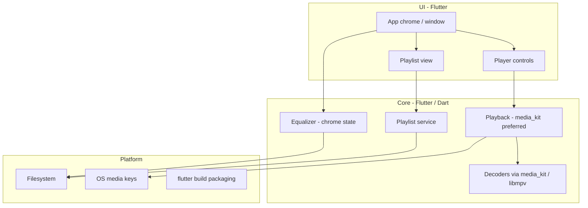

# Tramp architecture

Living design map of how Tramp is structured. Agents and humans update this whenever the app’s shape changes. Domain terms live in [`CONTEXT.md`](../CONTEXT.md); hard-to-reverse decisions live in [`docs/adr/`](adr/).

## Status

**v1 implemented.** All modules below match the shipped codebase. Product spec: [`tramp-v1-spec.md`](tramp-v1-spec.md). Stack locked (Flutter). App at repo root (`lib/`, `pubspec.yaml`, desktop runners under `windows/`, `macos/`, `linux/`). Release packaging smoke-tested on Windows (`flutter build windows`); macOS/Linux builds require those hosts.

## Intended product shape (v1)

- Multi-platform desktop player (Windows, Linux, macOS); shippable via Flutter packaging (stores not required)
- Local playback; scalable UI with custom **app chrome** (no OS window frame)
- Playlist-centric (M3U/M3U8); file associations for v1 audio + playlists; no media library in v1
- Classic Winamp WSZ/bitmap skins, gapless, and crossfade: out of v1
- Product spec target: `docs/tramp-v1-spec.md`
- UI direction: graphite chrome redesign — fixed logical canvases (main 812×242, equalizer 812×206) with absolute placement, zoom at the root; see `docs/superpowers/specs/2026-08-02-graphite-chrome-redesign-design.md`

## System overview

## Modules

| Area | Responsibility | Status |
|------|----------------|--------|
| App chrome / UI | `TrampShell` (wiring still catching up to redesign), `MainPlayerPanel` (fixed 812×242 absolute canvas), `PlaylistPanel`, `EqualizerPanel` (fixed 812×206 absolute canvas), `lib/ui/chrome/` (`ChromeButton`, `ChromeSlider`, `MetalPanel`, `TrampTitleBar`, `LcdText`, `SpectrumVisualizer`, `TrampMark`, `TrampLogo`, transport icons); frameless resize/drag via `window_manager`; keyboard shortcuts | Implemented (shell/app integration in progress) |
| Brand art | Full colour badge is `lib/ui/chrome/logo.svg` via `TrampLogo` (app icon / splash / About). Compact title-bar mark is `TrampMark` (ring + headphones). Chrome widgets other than the logo stay hand-drawn in Dart so they can react to state | Implemented |
| Playback | `PlayerEngine` seam, `PlaybackController`, `MediaKitPlayerEngine` (local files via media_kit/libmpv); shuffle/repeat/volume/mute/seek; `levelsStream` → `AudioLevels` (media_kit emits `synthetic: true` frames; `SpectrumVisualizer` subscribes directly, not via `notifyListeners`); `formatStream` → `AudioFormatInfo` (bitrate/sample rate/channels as controller state via `notifyListeners`) | Implemented |
| Formats | MP3, AAC/M4A, FLAC, WAV, Ogg Vorbis, Opus via media_kit | Implemented |
| Playlist | Open/save M3U/M3U8, add/remove/reorder, play from selection, restore last playlist (`PlaylistController`, `M3uCodec`, `PlaylistStore`) | Implemented |
| Equalizer | UI: `EqualizerPanel` (preamp + ten bands, ON/AUTO, presets menu, windowshade collapse). State: `EqualizerSettings`, `EqualizerPresets`, `EqualizerController`; persists via `TrampSettings` / `SettingsStore`; `EqualizerSink` seam has only `NoopEqualizerSink` — gains do not reach the audio path (shipped libmpv disables filters while reporting success) | Chrome UI + state |
| Platform | `tramp_window` (frameless chrome); `file_open` (pickers, folder expand, DnD); `launch_args` (argv → playlist/audio); file associations (Windows registry, macOS Info.plist, Linux `.desktop`); `OsMediaControls` (Windows SMTC, macOS MPRemoteCommandCenter; **Linux MPRIS stub — v1 gap**); `SettingsStore` (`settings.json`) | Implemented |

## Playback vs selection

`PlaybackController` keeps **`playingIndex`** (and path) separate from playlist **`selectedIndex`**. Transport title and OS media metadata follow the playing track; playlist row highlight follows selection. `playPause` opens the selected row when nothing is open or selection differs from the playing track.

## Known v1 gaps

- **Linux MPRIS** — session D-Bus player not registered; in-app shortcuts/media keys when focused still work.
- **Second-instance “Open with”** — argv on cold start only; no IPC to an already-running instance.
- **macOS/Linux release smoke** — not run on the primary dev host (Windows verified).

## Stack

**Locked:** Flutter for v1 (Windows, Linux, macOS). Preferred defaults: `window_manager` (app chrome), media_kit/libmpv (playback), `flutter_svg` (brand art). Not locked: state management, routing, SDK versions, design-system packages. Not v1: Tauri, Electron, second UI toolkit.

- ADR: [0001-flutter-for-v1.md](adr/0001-flutter-for-v1.md)
- Research: [`.scratch/tramp-v1-spec/research/v1-stack.md`](../.scratch/tramp-v1-spec/research/v1-stack.md)

## ADRs

- [0001 — Flutter for Tramp v1](adr/0001-flutter-for-v1.md)
