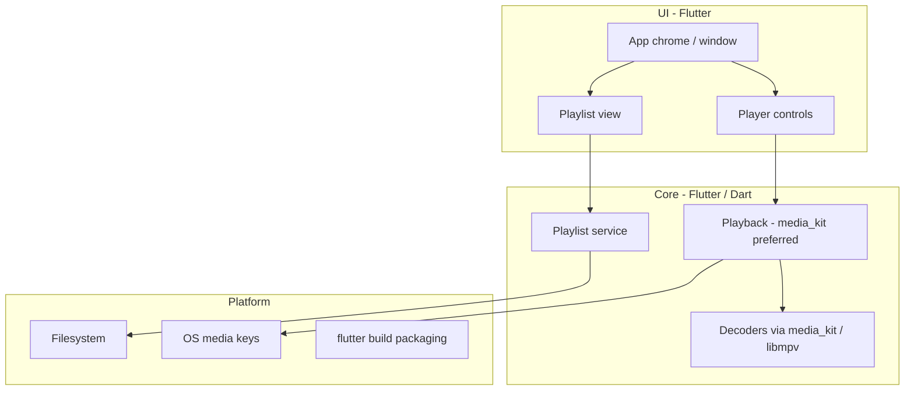

# Tramp architecture

Living design map of how Tramp is structured. Agents and humans update this whenever the app’s shape changes. Domain terms live in [`CONTEXT.md`](../CONTEXT.md); hard-to-reverse decisions live in [`docs/adr/`](adr/).

## Status

**Implementation in progress.** v1 product spec is written at [`tramp-v1-spec.md`](tramp-v1-spec.md). Stack is locked (Flutter). The Flutter app lives at repo root (`lib/`, `pubspec.yaml`, desktop runners under `windows/`, `macos/`, `linux/`). Wayfinder map: `.scratch/tramp-v1-spec/`.

## Intended product shape (v1)

- Multi-platform desktop player (Windows, Linux, macOS); shippable via Flutter packaging (stores not required)
- Local playback; scalable UI with custom **app chrome** (no OS window frame)
- Playlist-centric (M3U/M3U8); file associations for v1 audio + playlists; no media library in v1
- Classic Winamp skins, gapless, and crossfade: out of v1
- Product spec target: `docs/tramp-v1-spec.md`
- UI direction: transport-stack layout; paper/ink design language (see `.scratch/tramp-v1-spec/prototype/?variant=W`)

## System overview

## Modules (expected)

| Area | Responsibility | Status |
|------|----------------|--------|
| App chrome / UI | One-window scalable surface, resize, drag-to-move, close/minimize (`window_manager` preferred) | Scaffolding |
| Playback | Transport, seek, volume, shuffle/repeat (media_kit preferred) | Not started |
| Formats | MP3, AAC/M4A, FLAC, WAV, Ogg Vorbis, Opus | Not started |
| Playlist | Open/save M3U/M3U8, edit order, restore last playlist | Not started |
| Platform | Media keys, `flutter build` packaging per OS | Not started |

## Stack

**Locked:** Flutter for v1 (Windows, Linux, macOS). Preferred defaults: `window_manager` (app chrome), media_kit/libmpv (playback). Not locked: state management, routing, SDK versions, design-system packages. Not v1: Tauri, Electron, second UI toolkit.

- ADR: [0001-flutter-for-v1.md](adr/0001-flutter-for-v1.md)
- Research: [`.scratch/tramp-v1-spec/research/v1-stack.md`](../.scratch/tramp-v1-spec/research/v1-stack.md)

## ADRs

- [0001 — Flutter for Tramp v1](adr/0001-flutter-for-v1.md)
