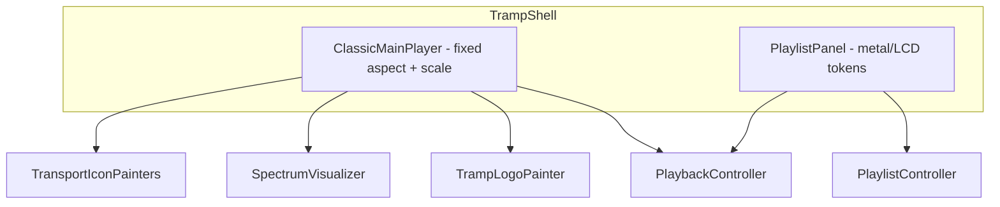

# Classic main player chrome — design

**Status:** Approved — implemented (docs/cleanup Task 8); plan at `docs/superpowers/plans/2026-08-01-classic-main-player.md`  
**Date:** 2026-08-01  
**Visual source of truth:** [`assets/tramp-main-player-idealized-mockup.png`](assets/tramp-main-player-idealized-mockup.png)

## Goal

Replace Tramp’s paper/ink transport chrome with a **close facsimile** of the classic Winamp 2.x Base Skin design language: same general layout, colors, and control placement — not a pixel replica. New vector icons, **TRAMP** wordmark, and an original soft pin-up logo (woman with eyes closed, headphones). **No bitmap skin assets.** Scalability (uniform scale of the player block) is paramount.

## Decisions locked

| Topic | Choice |
|-------|--------|
| Reference look | Winamp 2.x Base Skin language; idealized mockup above is the target |
| Out of player chrome | Balance slider, EQ |
| Scope this pass | Main player fully restyled; playlist gets **matching chrome tokens**, list layout unchanged |
| Spectrum | Vector bars; drive from playback when possible, tasteful pulse while playing otherwise |
| Scaling | Fixed classic aspect; scale player as one unit; extra window width/height → playlist |
| Rendering approach | Vector paint system (`CustomPainter` / decorations / path icons); no raster images |
| Logo | Soft illustrative pin-up + **TRAMP** wordmark in title bar |
| Mute | Keep mute behavior without a prominent extra button (e.g. click speaker / volume-end affordance) so the mockup layout stays intact |

## Non-goals

- Exact Winamp skin bitmaps or WSZ loading
- Detachable EQ / multi-window Winamp layout
- Restyling playlist row semantics (reorder, selection, open/save) beyond chrome
- Perfect FFT spectrum accuracy as a v1 gate (honest pulse fallback is acceptable)

## Architecture

Keep playback/playlist controllers unchanged. UI chrome is a presentation swap.

### Module boundaries

| Unit | Responsibility | Depends on |
|------|----------------|------------|
| `ClassicMainPlayer` | Layout geometry matching mockup; wires controls to playback | `PlaybackController`, chrome widgets |
| `TrampChrome` / color tokens | Metal greys, LCD greens, bevel metrics | None |
| Metal / LCD painters | Seamless brushed panels, inset displays | Tokens |
| Transport icon painters | Prev / play / pause / stop / next (and open if kept) | Tokens |
| `TrampLogoPainter` | Soft pin-up mark | Tokens |
| `SpectrumVisualizer` | Bars from audio levels or pulse fallback | Playback playing state; optional engine levels API |
| Scaled player host | Centers/scales `ClassicMainPlayer` to available width | Shell |
| Playlist chrome restyle | Same tokens on toolbar/rows/background | Tokens |

Paper/ink `TitleBar`, `TransportPanel`, `TrampButton`, and `InkSlider` were retired; the player stack uses `ClassicMainPlayer` + `lib/ui/chrome/`. Playlist keeps list semantics with matching metal/LCD chrome.

## Layout (main player)

Match the mockup structure (top → bottom):

1. **Title bar** — logo mark | **TRAMP** wordmark | drag region | minimize | close  
2. **LCD row** — left: spectrum + large time; right: scrolling title, kbps/kHz/stereo, SHUFFLE / REPEAT, **PL** toggle  
3. **Seek** — full-width groove + metal thumb  
4. **Transport row** — five square metal buttons (prev, play, pause, stop, next) + **VOLUME** slider  

Canonical logical size: measure aspect ratio from the locked mockup PNG and use that as the player’s layout size before uniform scale. Host scales so bevels and icons stay proportional; do not stretch independently on X/Y.

Window shell remains frameless; drag via title bar; resize edges unchanged.

## Visual system

### Materials (vector only)

- **Metal:** layered linear/radial gradients + light top bevel / dark bottom bevel; optional subtle noise via shader or fine gradient banding — must look continuous when scaled (no tiled bitmap brushed metal).  
- **LCD:** dark green inset, lime phosphor text, soft inner shadow. Prefer a monospace / LCD-like face (existing IBM Plex Mono is acceptable if styled to the LCD; dedicated LCD-style font only if it stays vector/font-based).  
- **Controls:** raised metal buttons with embossed vector icons; pressed state = inverted bevel.

### Tokens

Replace paper/ink player palette with tokens extracted from the mockup (exact hex locked during implementation by sampling the PNG), e.g.:

- Metal face / mid / shadow  
- LCD background / phosphor / dim phosphor  
- Accent on seek/volume fill (green channel style)  
- Border / groove depths  

Update `docs/tramp-v1-spec.md` UI direction and `docs/architecture.md` in the same implementation work so product docs match reality.

## Spectrum

1. Prefer real or quasi-real levels from the playback stack if media_kit (or a thin analyzer wrapper) can supply them without blocking UI.  
2. Else: while `playing`, animate tasteful bar motion seeded by time + optional volume; when stopped/paused, collapse or idle low.  
3. Draw only with `CustomPainter` (rects/paths).

## Logo

Implement as `CustomPainter` (or composed painters), soft illustrative pin-up matching the mockup: closed eyes, headphones, warm shading via gradients — **not** a PNG. Iterate visually against the locked mockup until title-bar size remains readable. Wordmark is painted or typographic chrome lettering consistent with the mockup, not the old Syne-on-ink brand strip.

## Playlist panel

- Background, toolbar, and selection chrome use the same metal/LCD token family.  
- Keep: open/save/add, reorder, select, play-on-activate.  
- Do not recreate Winamp’s separate PL window geometry; remain the lower region of the single window.

## Data / control mapping

| UI | Behavior |
|----|----------|
| Play / Pause / Stop / Prev / Next | Existing `PlaybackController` APIs |
| Seek / Volume | Existing seek + volume |
| Shuffle / Repeat indicators | Toggle / cycle existing modes; LCD-style affordances |
| PL | Playlist stays the lower pane of the single window (no detach). PL control focuses the playlist (keyboard/list focus); visually “on” when the playlist has focus or tracks |
| Min / Close | Existing `window_manager` actions |
| Open files | Playlist toolbar + existing shortcuts only — no eject button on the main player in this pass |

## Testing

- Widget tests: transport actions still fire; shuffle/repeat/volume/seek wiring unchanged in meaning.  
- Golden or screenshot tests optional for chrome; at minimum, manual compare against locked mockup on Windows at 100% and 150% scale.  
- No requirement for pixel-identical goldens to the PNG (soft logo and metal will differ slightly).

## Implementation order (for the plan)

1. Tokens + retire paper/ink from player/playlist surfaces  
2. Scaled `ClassicMainPlayer` shell geometry (empty metal frame)  
3. LCD + seek + volume + transport icons wired  
4. Spectrum (pulse, then real levels if feasible)  
5. Logo painter polish  
6. Playlist chrome restyle  
7. Spec/architecture/README UI direction updates  

## Related docs

- Product spec (will be updated): [`docs/tramp-v1-spec.md`](../../tramp-v1-spec.md)  
- Architecture (will be updated): [`docs/architecture.md`](../../architecture.md)  
- Domain: [`CONTEXT.md`](../../../CONTEXT.md)
