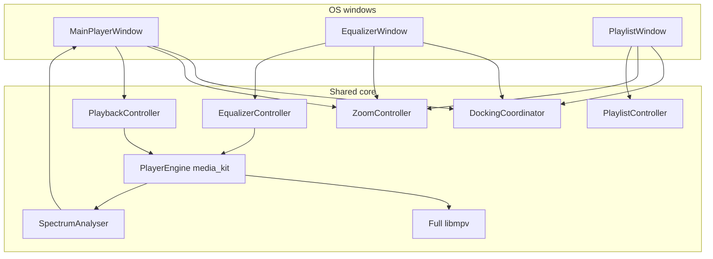

# Tramp mockup multi-window redesign — design

Host is Qt 6 ([ADR 0016](../../adr/0016-qt-for-v1.md)); Flutter mentions below are historical.

Rebuild Tramp around [`player-mockup-2.html`](../../../player-mockup-2.html):
three Winamp-style dockable windows, **code-constructed** chrome that matches the
mockup exactly, and **full libmpv** (features first) so audible EQ, real
spectrum, and force-mono are real.

**Supersedes** the *current product look and window model* in
[`2026-08-02-graphite-skin-delivery-design.md`](2026-08-02-graphite-skin-delivery-design.md)
and the painted/PNG graphite lineage. Those docs remain historical; they must
not steer new work.

**Revised 2026-08-09:** docking move/snap ownership, compact EQ/PL titles, EQ
band fill, `.wbtn` bevel fidelity, and Windows taskbar (main only) are pinned in
[`2026-08-09-ui-polish-docking-taskbar-design.md`](2026-08-09-ui-polish-docking-taskbar-design.md).
Where that polish doc conflicts with docking/title details below, **prefer the
polish doc**.

Product/architecture/CONTEXT/ADRs that conflict with this document are
**rewritten or explicitly superseded in the same delivery** — legacy decisions
must not clutter the path forward.

Vocabulary: [`CONTEXT.md`](../../../CONTEXT.md) (to be updated).  
Living map: [`docs/architecture.md`](../../architecture.md) (to be updated).  
Mockup (visual + geometric authority): [`player-mockup-2.html`](../../../player-mockup-2.html).

---

## 1. Goals

- **100% visual match** to `player-mockup-2.html` at 100% zoom — geometry,
  tokens, type, gradients, shadows, radii, spacing, icon paths. No “inspired
  by,” no leftover PNG graphite faces, no Material defaults on chrome.
- Three **detachable** windows with **Winamp-style docking** (edge snap).
- **Code-constructed** chrome in Flutter; the HTML/CSS mockup is the recipe.
- **Full libmpv** on Windows, macOS, Linux — no compressed/minimal media_kit
  audio builds. Features first; binary size later.
- Audible 10-band EQ (measurement-gated), **real** LCD spectrum (20 bars),
  force-mono.
- Global discrete zoom from the main title bar applies to all three windows.
- Revise product spec, architecture, CONTEXT, and ADRs so recorded decisions
  match this direction.

## 2. Non-goals

- Classic Winamp **WSZ** skin loading
- Classic visualization modes/plugins (clutterbar **V**)
- Clutterbar **D** / doublesize (zoom controls already exist)
- Media library / streaming / gapless / crossfade
- PNG-first graphite skin delivery (retired)
- Single-window EQ/PL mutual exclusion as the product model (retired)
- Trusting mpv filter “success” without measuring output
- Approximate or partial chrome cutovers (no half-mockup / half-graphite ship)

## 3. Fidelity contract

| Rule | Detail |
|------|--------|
| Authority | Mockup CSS and markup at the **825× classic×3 grid** |
| Fonts | Exact mockup faces: **Tramp Condensed** (700), **Tramp Mono** (500), embedded and used on chrome |
| Live-only deltas | Real track text, times, spectrum, EQ curve values; pressed/hover/disabled states absent from static HTML — those states must still look native to this chrome |
| Verification | Side-by-side screenshot diffs (main, EQ, playlist, EQ shade, PL shade) vs mockup captures; mismatches are defects |
| Tokens | Checked-in token + geometry map derived from mockup `:root` and rules; Flutter constants mirror CSS — do not invent a parallel theme |

### Approved deltas from the static HTML

The mockup is static and shows five clutterbar glyphs (`O A I D V`). **Product UI
uses only `O A I`** (D and V dropped by decision). Compose the three-letter strip
so spacing/alignment still reads as intentional mockup chrome — never leave
disabled ghost `D`/`V` glyphs. All other chrome, layout, and materials match the
mockup.

### Palette (from mockup)

| Token | Value |
|-------|-------|
| shell-hi → deep | `#323744`, `#262b38`, `#1a1d26`, `#12141a`, `#0a0b0e` |
| ink / dim / faint | `#e8eaf0`, `#8b919e`, `#5b6270` |
| phos / hot / dim / deep | `#3de7ff`, `#b8f6ff`, `#1a7a88`, `#0d3d46` |
| accent / dim | `#ff3d9a`, `#8a2258` |
| well | `#050608` |

Phosphor in product language is **cyan** for this chrome (not chartreuse).

---

## 4. Approach

**Flutter + media_kit control seam, full libmpv binaries, rebuild chrome/windows.**

1. Keep `PlayerEngine` / media_kit for open, transport, seek, volume, playlist advance.
2. Replace compressed `media_kit_libs_*` with **our full libmpv** builds; packaging
   must load our binaries, not stock slim ones.
3. New multi-window host + `DockingCoordinator`.
4. Paint chrome in Flutter from the mockup recipe (retire PNG skin module).
5. Real `EqualizerSink` + spectrum analyser; Mono via mpv downmix.
6. **Spike gate** before claiming audible EQ: prove full libmpv is loaded on each
   OS; prove measured band response.

Fall back to direct libmpv FFI only if the media_kit + custom-binary spike fails.

---

## 5. Window model

### Windows

| Window | Default logical size (100% zoom) | Resize | Close |
|--------|----------------------------------|--------|-------|
| Main Player | **825 × 348** (tbar 42 + body 306) | Zoom only | Quits app |
| Equalizer | **825 × 348** | Zoom only | Hides |
| Playlist Editor | **825 × 696** (tbar 42 + body 654) | Width + height free | Hides |

EQ and PL may both be open. Main **EQ** / **PL** toggles show/hide those windows
(`.btn--on` when visible).

### Zoom

- One **global** discrete zoom step (retain the existing six-step ladder unless
  the rewritten product spec re-pins it).
- Main title-bar **− / +** (and shortcuts) change the step for **all three**
  windows.
- Pixel size = logical size × zoom. Playlist user size is stored in logical
  coordinates and scaled by the step.

### Docking

- Snap when a window edge approaches another’s edge/corner (threshold pinned in
  the coordinator / polish design).
- Each title-bar drag moves only that window; snap only on EQ/PL finalize
  (EQ any side; playlist top/bottom + optional orthogonal flush).
  See [`2026-08-09-ui-polish-docking-taskbar-design.md`](2026-08-09-ui-polish-docking-taskbar-design.md).
- Undock via peel-on-EQ/PL-drag, break-threshold, and/or modifier.
- Persist dock graph, positions, visibility, shade, and playlist logical size.
- **Windows taskbar:** only the main window appears (`skipTaskbar` on secondaries).

### Windowshade

- EQ and Playlist title-bar **collapse** → title bar only; expand restores prior
  logical body size.
- Docking layout uses shaded height.

### Minimize / always-on-top

- Main **minimize** hides visible secondaries then minimizes main; restore shows
  them again.
- Clutterbar **A** (always-on-top) applies to **visible** tramp windows.

### Drag

- Each title-bar / grip moves only that window. No OS title bar.

---

## 6. Chrome construction

All chrome is **code-constructed** (layered boxes, `CustomPainter`, shaders as
needed). No PNG panel faces, no nine-slice graphite pack, no crop pipeline.

### Shared parts (must match mockup CSS)

- Window shell: 6px radius, multi-stop vertical gradient, inset bevels, outer
  shadow, ~5% noise overlay (overlay blend)
- Title bar: 42px; cyan→magenta grip rails; main: logo disc + wordmark + panel
  name; EQ/PL: **role title only** (product override); `wbtn` / `wbtn--close`
  with inset bevel chrome
- `.screen` wells: radial glass, scanlines, cyan hairline inset
- `.btn` / `.btn--on` / `.btn--label` / `.btn--menu` caret / `.led` / `.led--lit`
- Slider `.track` / `.fill` / `.thumb` (seek thumb **22 × 32**)
- `.plate` brushed strip, `.rail` brushed filler, corner `.rivet`s
- SVG icon paths from the mockup (same viewBoxes/paths)

Pressed/hover/disabled are incremental variants of these materials — never stock
Flutter ink splash as the visible affordance.

### Retirement

- `GraphiteSkin` / PNG assets under `assets/skin/graphite/` — removed from the
  product path
- ADR 0004 PNG-first mandate — superseded
- Brand mark remains vector (mockup embedded logo) in the title-bar disc and
  playlist watermark treatment

---

## 7. Main player

**Canvas:** 825 × 348.

### Title bar

Logo · `TRAMP` + `1.0` · grip · `Main Player` · grip · Minimize · Zoom − ·
Zoom + · Close.

### Clutterbar

Absolute **left 22, top 18, 26 × 129**. Product letters: **O / A / I** only
(no V, no D — do not leave ghost glyphs).

| Letter | Action |
|--------|--------|
| O | Options menu (settings / about / quit, etc.) |
| A | Always-on-top for the visible docked group (lit = on) |
| I | Track / file info dialog |

### Display well

**left 96, top 14, 705 × 132**, `.screen`.

- Elapsed time (large mono ~46px) + `ELAPSED` caption (elapsed/remaining click
  toggle may be retained as classic behavior; default matches mockup)
- **20** spectrum bars, cyan→accent gradient + peak caps — **real** levels
- Now-playing title (phosphor-hot, right-edge marquee mask when overflowing)
- Sub: album · year · track N of M when known
- Meta: bitrate, sample rate, STEREO/MONO **source** tag, magenta format chip

### Volume row (top 156, height 40)

Mute · Vol + wide slider · **Mono** (force-downmix when on) · EQ · PL.

- Meta STEREO/MONO reflects **source** layout; Mono button reflects **output**
  mode.

### Seek row (top 206)

Elapsed stamp · seek track · duration stamp.

### Transport row (top 246, height 50)

Prev · **Play** (emphasized) · **Pause** · Stop · Next · Open/eject · rail ·
Shuffle · Repeat (LEDs when on).

Play and Pause are **separate** controls. Repeat: off → all → one (LED on for
all/one; label/LED details pinned in plan without breaking mockup geometry).

---

## 8. Equalizer

**Canvas:** 825 × 348. Zoom-only. Title: Collapse (shade) · Close (hide). No
per-window zoom buttons.

### Head

**On** · **Auto** · **Presets ▾** · `Curve · {name}`.

### Curve display

**372 × 62** `.screen` at top-right. Live plot of current preamp + band gains
(zero line, cyan fill, `#8df2ff` stroke + glow) — not static decoration.

### Bands

Scale `+12` / `0` / `−12`; preamp (wider) + 60, 170, 310, 600, 1k, 3k, 6k, 12k,
14k, 16k. Range **±12 dB**. Geometry per mockup (preamp 62px, bands 50px, etc.).

### Audio

When On, commit a real libmpv equalizer graph. **Ship audible EQ only after
measurement proves band response.** Auto keeps existing Tramp auto semantics
(enable with track change) unless the rewritten spec says otherwise — do not
invent new DSP behavior in implementation.

---

## 9. Playlist

**Default canvas:** 825 × 696; freely resizable. Shade + close-hides.

### List well

- Grows with window; footer stays bottom-anchored (footer block ~132px + padding
  as mockup)
- Row height **37px**; selected cyan wash; playing phosphor-hot + magenta leading
  bar
- Selection ≠ playing index (existing rule)
- Soft logo watermark (mockup opacity/blend)
- Custom 14px scrollbar
- Drag-and-drop enqueue

### Footer strip (`.plate`)

Add · Remove · Sort (menu) · Options (menu) · rail · mini Prev / Play / Next ·
TOTAL time (`.screen`).

**Sort:** title / artist / duration / path / reverse (exact set in product spec
rewrite; no library features).

**Options:** load/save M3U/M3U8, clear, select-all / invert, and other existing
playlist ops (replaces old LOAD/SAVE/ADD-only labeled toolbar).

### Status

Playlist filename · track count · `Playing N` · drop hint.

### Persistence

Last playlist path, logical window size, shade, dock offsets — restored on launch.

---

## 10. Audio engine

### Full libmpv

- Bundle full libmpv (+ required FFmpeg) for Win/macOS/Linux.
- Override media_kit’s default slim libs so the process cannot silently load them.
- Formats must still cover: MP3, AAC/M4A, FLAC, WAV, Ogg Vorbis, Opus.

### Equalizer

Replace `NoopEqualizerSink` with a real sink gated by measurement tests.

### Spectrum

Retire synthetic levels as the normal product path. Prefer PCM/analyser → STFT →
fold to **20** bars (mpv `af-metadata` is not relied on for true multi-band
spectrum — architectural limit documented in prior research).
`AudioLevels.synthetic` may exist only as hard-fail/dev signal.

### Mono

Force downmix via mpv when Mono is on (exact property/filter pinned in plan).

### Spike gate

Before UI claims audible EQ:

1. Confirm loaded binary is our full build on each OS.
2. Confirm measured output shows expected band gains.

---

## 11. Runtime structure

One Flutter process; three frameless windows sharing:

- `PlaybackController`, playlist store, EQ controller, zoom controller,
  settings, `DockingCoordinator`

Conceptual seams:

| Seam | Role |
|------|------|
| `DockingCoordinator` | Snap, groups, persist layout |
| Chrome primitives | Shell, tbar, screen, btn, slider, led (token-driven) |
| `LibmpvBundle` | Full binaries + load-path guarantee |
| `EqualizerSink` | Real audible EQ |
| `SpectrumAnalyser` | Real 20-bar levels |
| Clutterbar / Mono / window visibility | As specified above |

Remove: single `TrampShell` lower-region EQ/PL swap as the product model; PNG
skin layer as the look source.

---

## 12. Decision hygiene (docs / ADRs)

Delivered with this redesign (not deferred):

| Artifact | Action |
|----------|--------|
| `docs/tramp-v1-spec.md` | Rewrite for multi-window, code chrome, full libmpv, audible EQ, real spectrum, O/A/I, Mono, fidelity bar |
| `docs/architecture.md` | Reflect three windows, docking, code chrome, full libmpv, real EQ/spectrum |
| `CONTEXT.md` | Cyan phosphor; docking; code-constructed chrome; retire PNG-graphite-as-current; update synthetic-levels language |
| ADR 0001 (Flutter) | **Keep** |
| ADR 0002 (fixed canvas zoom) | **Revise** — global zoom across three canvases; playlist free resize |
| ADR 0003 (zoom-only / single-window framing) | **Supersede** — replace with multi-window + docking ADR |
| ADR 0004 (PNG graphite) | **Supersede** — replace with code-constructed mockup-chrome ADR |
| New ADRs | Full libmpv bundling; multi-window docking; code-constructed mockup chrome |

Prior research that concluded EQ/spectrum impossible on **slim** libmpv remains
valid as history for those binaries; it is **not** an active constraint under
full libmpv.

---

## 13. Testing

- Golden pixel comparisons vs mockup at 100%: main, EQ, playlist, both shades
- Docking: snap, undock, persist restore
- EQ measurement harness (fixture tones → band response)
- Spectrum: analyser unit tests; assert not synthetic in normal play
- Mono: output channel layout
- Regression: formats, M3U open/save, media keys, file open / DnD, zoom steps

## 14. Rollout

- Chrome cutover is **atomic** for all three windows — no mixed graphite/mockup UI.
- Libmpv swap may land before EQ is enabled in UI; the EQ **On** control must not
  imply audible processing until the measurement gate passes.
- Mockup file remains in-repo as the visual authority until goldens fully cover it.

---

## 15. Open pins (implementation plan, not design forks)

These do not reopen product direction; they are detailed in the implementation
plan:

- Exact docking snap/break thresholds and undock modifier
- Repeat LED/label affordance for off/all/one within mockup geometry
- Exact mpv property/filter strings for EQ graph and Mono downmix
- Spectrum analyser placement (isolate vs in-process) and PCM source
- Multi-window Flutter plugin / API choice on each OS
- Whether product doc keeps the “v1” filename or is retitled
