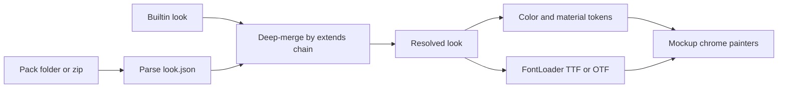

# Look pack JSON format

Date: 2026-08-09  
Status: Implemented  
Branch intent: shareable pack format for recoloring / retyping mockup chrome (`src/look.*`)

Related: [`src/mockup_tokens.h`](../../../src/mockup_tokens.h), [`architecture.md`](../../architecture.md), [`CONTEXT.md`](../../../CONTEXT.md).

## Problem

Tramp’s chrome is code-constructed from a fixed mockup token table and two bundled fonts. Authors and users need a way to ship alternate **looks** (palette, a few materials, typefaces) without replacing layout or art, and without inventing a second skin engine (classic Winamp WSZ remains out of scope).

## Product term

A **look pack** is a directory or zip that overrides colors, named materials, and optional font files for the built-in mockup chrome. Geometry, icon paths, noise texture, and logo SVG stay with the code-constructed chrome.

_Avoid_: classic skin, WSZ, theme (when meaning this pack), graphite skin.

## Goals

- Human-readable JSON that mirrors the mockup token families (not obscure code abbreviations).
- Partial packs via explicit `extends`.
- Bundled builtin look plus user-installable packs (folder or zip, same internal layout).
- External TTF/OTF for chrome and LCD roles.
- Configurable looks directory; reload on path change; fall back to builtin if the active pack disappears.
- Friendly pack ids (no reverse-DNS); install conflicts prompt Replace / Cancel.

## Non-goals

- Classic Winamp skin loading or layout replacement.
- Changing geometry, icon paths, noise, or logo via the pack.
- Variable fonts.
- Hot-reload while editing `look.json` on disk (re-select / directory change reloads).
- Silent overwrite on install.

## Pack layout

Same layout for a folder on disk or the root of a zip:

```text
neon-cyan/
  look.json
  fonts/                 # optional; only if the pack overrides type
    chrome.otf
    lcd.ttf
```

Manifest file name is always `look.json` at the pack root.

## Manifest schema (`formatVersion`: 1)

| Field | Required | Notes |
|-------|----------|--------|
| `formatVersion` | yes | Integer `1` for this design |
| `id` | yes | Friendly slug; see Identity |
| `name` | yes | Display title |
| `author` | no | Shown in conflict prompts and pack lists |
| `extends` | yes | `"builtin"` or another installed pack `id` |
| `colors` | no | Partial or full; omitted keys inherit |
| `materials` | no | Partial or full; omitted keys inherit |
| `fonts` | no | Per-role overrides; omitted roles inherit |

Unknown keys under `colors`, `materials`, or `fonts` cause the pack to **fail validation** (fail loud for authors). Top-level unknown keys are ignored for forward compatibility, except a future loader may warn.

### Identity

- `id` must match `[a-z0-9]+(-[a-z0-9]+)*` (e.g. `neon-cyan`, `graphite-night`).
- Reserved: `builtin` (embedded; never a user folder name).
- No reverse-DNS / dotted package ids.
- On disk the pack lives at `<looksDir>/<id>/`. The directory name must equal the manifest `id` (mismatch fails install).

### Colors

Nested, human-readable paths. Values are `#RRGGBB` or `#RRGGBBAA` strings.

| JSON path | Maps to `MockupTokens` |
|-----------|-------------------------|
| `colors.shell.highlight` | `shellHi` |
| `colors.shell.base` | `shell` |
| `colors.shell.mid` | `shellMid` |
| `colors.shell.low` | `shellLo` |
| `colors.shell.deep` | `shellDeep` |
| `colors.ink.default` | `ink` |
| `colors.ink.dim` | `inkDim` |
| `colors.ink.faint` | `inkFaint` |
| `colors.phosphor.default` | `phos` |
| `colors.phosphor.hot` | `phosHot` |
| `colors.phosphor.dim` | `phosDim` |
| `colors.phosphor.deep` | `phosDeep` |
| `colors.accent.default` | `accent` |
| `colors.accent.dim` | `accentDim` |
| `colors.well` | `well` |

Code may keep short Dart names internally; pack authors only see the JSON paths above.

### Materials

Named looks that are not a single solid color. Omitted keys inherit from `extends`.

| JSON path | Meaning |
|-----------|---------|
| `materials.bevel.lightOpacity` | 0–1; mockup `--bevel-light` |
| `materials.bevel.softOpacity` | 0–1; mockup `--bevel-soft` |
| `materials.spectrum.stops` | Ordered `#RRGGBB[AA]` list for spectrum bars and EQ band fill |
| `materials.rail.stops` | Ordered stops for cyan→magenta grip / brush rails |

Array fields (`stops`) **replace wholly** on merge (not element-wise). Length is flexible; the app samples along the list.

### Fonts

Two roles matching today’s chrome condensed vs LCD mono:

```json
"fonts": {
  "chrome": { "file": "fonts/chrome.otf", "weight": 700 },
  "lcd": { "file": "fonts/lcd.ttf", "weight": 500 }
}
```

- `file` is pack-relative; allowed extensions: `.ttf`, `.otf` only.
- Omit a role → inherit the parent pack’s face (`builtin` = TrampCondensed / TrampMono).
- `weight` is a registration hint when a single file is shipped.
- Variable fonts are out of format v1.
- Font licensing is the author’s responsibility (optional future `license` string is not required here).

## Example (partial overlay)

```json
{
  "formatVersion": 1,
  "id": "neon-cyan",
  "name": "Neon Cyan",
  "author": "Example",
  "extends": "builtin",
  "colors": {
    "phosphor": {
      "default": "#3de7ff",
      "hot": "#b8f6ff"
    },
    "accent": {
      "default": "#ff3d9a"
    }
  },
  "materials": {
    "spectrum": {
      "stops": ["#cbf9ff", "#3de7ff", "#1b9ec4", "#ff3d9a"]
    }
  },
  "fonts": {
    "lcd": { "file": "fonts/lcd.ttf", "weight": 500 }
  }
}
```

## Resolution and merge



1. Walk `extends` until `builtin`. Cap chain length at 8; reject cycles.
2. Deep-merge objects from base to leaf; leaf wins.
3. Arrays (`stops`) replace wholly.
4. After merge, load each overridden font role from pack bytes via Flutter `FontLoader` / `loadFontFromList`, registering a stable family name derived from pack id + role (e.g. `Look.neon-cyan.chrome`).
5. Validation or font load failure → do not activate the pack; keep the last good look (usually builtin) and surface a short error.

Active pack id is persisted in settings and applied for all three windows via the session host.

## Install locations

### Default looks directory

Same application support root as `settings.json` (`path_provider` `getApplicationSupportDirectory`), plus `looks/`:

| OS | Default (illustrative) |
|----|-------------------------|
| Windows | `%APPDATA%\com.tramp\tramp\looks\` |
| macOS | `~/Library/Application Support/com.tramp.tramp/looks/` |
| Linux | `$XDG_DATA_HOME/com.tramp.tramp/looks/` or `~/.local/share/com.tramp.tramp/looks/` |

Exact parent folder is whatever the platform already uses for Tramp support files. Each installed pack is `<looksDir>/<id>/look.json` (+ optional `fonts/`).

`builtin` is embedded in the app; it is never copied into this directory.

### Custom directory

Settings store an optional user-chosen looks directory path. Empty / null means the default above. The user may point Tramp at any folder they own.

**On directory change:** rescan the tree, rebuild the installed catalog, re-resolve the active look, and reload fonts. If the active `id` is not present in the new tree, activate **`builtin`** and persist that choice.

### Zip vs folder

- Authoring: directory with the layout above.
- Sharing: zip with the same internal layout (pack root contains `look.json`).
- Install from zip: extract into `<looksDir>/<id>/` (after conflict resolution).

## Install conflicts

If `<looksDir>/<id>/` already exists when installing:

1. Show the **installed** pack’s `name` + `author` vs the **incoming** pack’s `name` + `author`.
2. User chooses **Replace** or **Cancel**.
3. No silent overwrite.

## Builtin look

The embedded `builtin` pack (picker name **Tramp**) is the current mockup palette and materials (from `player-mockup-2.html` / `MockupTokens`) plus bundled TrampCondensed and TrampMono. It is the root of every `extends` chain. The wire id stays `builtin`.

## Testing

- Parse + validate fixtures (good partial, unknown key, bad id, cycle, missing font file).
- Merge: partial overlay leaves unspecified colors as builtin; `stops` replace wholly.
- Install conflict prompt path (replace vs cancel) without touching real user dirs in unit tests.
- Directory change: missing active id → builtin.
- Goldens / widget tests that assert text continue to load the active look’s faces (or builtin).

## Implementation

Implemented in `src/look.*` (parse, merge, catalog, install) and `SkinController` on the session; chrome reads `ChromeTokens` from the active look. Install UI: Settings → Skins.
